```python
import time
from selenium import webdriver
from bs4 import BeautifulSoup
import pandas as pd
import requests
from urllib.request import Request, urlopen
import json
import re
import glob
import os
import numpy as np
import matplotlib as mpl
from matplotlib import pyplot as plt
%matplotlib inline
import warnings
from decimal import Decimal
import math
import seaborn as sns
from scipy.stats import chi2_contingency
from scipy import misc
from matplotlib.colors import ListedColormap
import sklearn
from sklearn import metrics
from sklearn.model_selection import train_test_split
from sklearn import tree
from sklearn.model_selection import GridSearchCV
from sklearn.metrics import make_scorer
from sklearn.ensemble import RandomForestClassifier
from sklearn import linear_model, metrics, preprocessing
from sklearn.preprocessing import StandardScaler, MinMaxScaler
from sklearn.linear_model import LogisticRegression, LinearRegression
from sklearn.metrics import r2_score, f1_score
from sklearn.decomposition import PCA
from sklearn.preprocessing import MinMaxScaler
from sklearn.preprocessing import minmax_scale
from sklearn.neighbors import KNeighborsClassifier
from sklearn.model_selection import cross_val_score
from sklearn.naive_bayes import GaussianNB
from IPython.display import Image, display  
from collections import Counter
import pydotplus 

warnings.filterwarnings("ignore")
pd.set_option('display.max_rows', 500)
pd.set_option('display.max_columns', 500)
pd.set_option('display.width', 1000)
```

# 1.1 Scraping - Selenium Infinite Scrolling


```python
html_companies_page = 'https://finder.startupnationcentral.org/startups/search'
```


```python
def get_driver():
    driver = webdriver.Firefox(executable_path=r'C:\Python34\geckodriver.exe')
    driver.get(html_companies_page)
    return driver
```

## We couldnt get all pages with requests, so we had to use selenium to implement infinite scroll so we can get all companies urls and later on scrape data from this pages.


```python
def infinite_scroll(driver):
    time.sleep(2)  # Allow 2 seconds for the web page to open
    scroll_pause_time = 1 
    screen_height = driver.execute_script("return window.screen.height;")   # get the screen height of the web
    i = 2
    while (i < 50):
        # scroll one screen height each time
        driver.execute_script("window.scrollTo(0, {screen_height}*{i});".format(screen_height=screen_height, i=i))  
        i += 1
        time.sleep(scroll_pause_time)
        scroll_height = driver.execute_script("return document.body.scrollHeight;")  
```


```python
driver = get_driver()
```


```python
infinite_scroll(driver)
```


```python
#linkedin login
driver = get_driver()
username = driver.find_element_by_id('username')
username.send_keys('yair.sultanv@gmail.com')

time.sleep(0.5)

password = driver.find_element_by_id('password')
password.send_keys('yairsultan')

time.sleep(0.5)

log_in_button = driver.find_element_by_class_name('btn__primary--large')
log_in_button.click()

time.sleep(3)
```

# 1.2 Scraping - Get Companies Urls


```python
def load_soup_object(html_file_name):
    html = open( html_file_name, encoding="utf8")
    soup = BeautifulSoup(html, 'html.parser')
    return soup

```

We had to split our requests to multiple files because after some time of infinite scorling we got blocked.


```python
def extract_companies_urls(html_link):
    html_link = "./Data/companies_urls/" + html_link
    soup = load_soup_object(html_link)
    companie_div = soup("div",attrs = {"class" : 'js-company-cards-list'})[0]
    links = list()
    for row in companie_div('div',attrs = {"class" : 'box-view-item'}):
        url = row('a')[0]['href']
        links.append(url)
    return links
      

```

### From each HTML page with multiple companies urls, we extracted the urls in to one big dataframe.


```python
list_50_to_90 = extract_companies_urls('Start-Up1950-1990.html')
```


```python
list_91_to_00 = extract_companies_urls('Start-Up1991-2000.html')
```


```python
list_01_to_05 = extract_companies_urls('Start-Up2001-2005.html')
```


```python
list_05_to_09 = extract_companies_urls('Start-Up2005-2009.html')
```


```python
list_10_to_11 = extract_companies_urls('Start-Up2010-2011.html')
```


```python
list_12 = extract_companies_urls('Start-Up2012.html')
```


```python
list_13 = extract_companies_urls('Start-Up2013.html')
```


```python
list_14 =extract_companies_urls('Start-Up2014.html')
```


```python
list_15 = extract_companies_urls('Start-Up2015.html')
```


```python
list_16 = extract_companies_urls('Start-Up2016.html')
```


```python
list_17 = extract_companies_urls('Start-Up2017.html')
```


```python
list_18 = extract_companies_urls('Start-Up2018.html')
```


```python
list_19 = extract_companies_urls('Start-Up2018.html')
```


```python
list_20_22 = extract_companies_urls('Start-Up2020-2022.html')
```


```python
link_list = list_50_to_90 + list_91_to_00 +list_01_to_05+list_05_to_09+ list_10_to_11 + list_12+list_13 + list_14 +list_15 +list_16 +list_17 +list_18 + list_19 +list_20_22  
```


```python
df = pd.DataFrame({'links' : link_list})
```


```python
df = df.drop_duplicates().copy()
```


```python
df = df.reset_index(drop=True)
```

### We ended up with csv file with more then 10,300 urls and saved it.


```python
df.to_csv("companies_urls.csv",index = False)
```

# 1.3 Scraping - Company Page Scraping


```python
def load_csv(fileName):
    return pd.read_csv(fileName)
```


```python
def load_soup_html(url):    
    html = requests.get(url)
    soup = BeautifulSoup(html.text, 'html.parser')
    return soup
```

### Let's load our urls csv from previous stage : 


```python
df = load_csv("companies_urls.csv")
```

### Let's define a function that extracts all of the features we want from the company page : 


```python
def get_df_companies(df):
    res_df = pd.DataFrame(columns=['COMPANIE_NAME', 'FOUNDED', 'BUSINESS_MODEL', 'EMPLOYEES','FUNDING_STAGE','RAISED'
                                   , 'PRODUCT_STAGE', 'NEWS_COUNT', 'FOUNDER_COUNT', 'TOTAL_ROUNDS', 'INVESTORS_COUNT'
                                   , 'COMPANY_STATUS', 'IS_ACADEMIC', 'SECTOR', 'TARGET_INDUSTORY'])
    for url in df['links']:
        print(url)
        soup = load_soup_html(url)
        
        company_dict = {
            "NAME": None,
            "FOUNDED": None,
            "BUSINESS MODEL": None,
            "EMPLOYEES": None,
            "FUNDING STAGE": None,
            "RAISED": 0,
            "PRODUCT STAGE": None,
            "NEWS": 0,
            "FOUNDERS": 0,
            "Total rounds": 0,
            "Investors": 0,
            "STATUS": "Active",
            "IS ACADEMIC": 0,
            "SECTOR": None,
            "TARGET INDUSTORY": None
        }
        
        name_div = soup("div",attrs = {"class" : 'top-profile-section'})
        if(not name_div):
            continue
            
        company_dict["NAME"] = soup("div",attrs = {"class" : 'top-profile-section'})[0]("div",attrs = {"class" : 'title'})[0].get_text().strip()

        COMPANY_PROFILE = soup("div",attrs = {"class" : 'metadata-wrapper'})
        if(len(COMPANY_PROFILE)):
            for div in COMPANY_PROFILE[0]("div",attrs = {"class" : 'item-bottom'}):
                company_dict.update( {div.get_text().strip(): div.find_previous('div').get_text().strip()})
            
        if(soup("div", attrs = {"id": "news-section"})):
            news_div = soup("div", attrs = {"id": "news-section"})[0]
            news_str = news_div("div", attrs = {"class": "section-text"})[0].get_text().strip()
            company_dict["NEWS"] = int(re.findall('\d+', news_str)[0])
            
        if(soup("div", attrs = {"id": "team-section"})):
            team_div = soup("div", attrs = {"id": "team-section"})[0]
            team_str = team_div("div", attrs = {"class": "section-text"})[0].get_text().strip()
            company_dict["FOUNDERS"] = int(re.findall('\d+', team_str)[0])
         
        FUNDING_DATA = soup("div",attrs = {"class" : 'funding-metadata'})
        if(len(FUNDING_DATA)):
            for div in FUNDING_DATA[0]("div",attrs = {"class" : 'subtitle'}):
                funding_text = div.get_text().strip()
                if(funding_text == 'Total rounds' or funding_text == 'Investors'):
                    company_dict[funding_text] = div.find_previous('div').get_text().strip()

        if(soup.find_all("div", string=["Public"])):
            company_dict["STATUS"] = "Public"
        elif(soup.find_all("div", string=["Acquired by"])):
            company_dict["STATUS"] = "Acquired"
        elif(soup.find_all("div", string=["Not Active"])):
            company_dict["STATUS"] = "Not Active"
            
        if(soup.find_all("div", string=["Academic technology"])):
            company_dict["IS ACADEMIC"] = 1
            
        sector_div = soup.find_all("use", attrs={"xlink:href": "#icon-classification-sector"})
        if(sector_div):
            sector_div = sector_div[0].parent.parent.parent.parent("a", attrs = {"class": "lead-title"})
            company_dict["SECTOR"] = sector_div[0].get_text().strip()
        
        industry_div = soup.find_all("use", attrs={"xlink:href": "#icon-classification-industry"})
        if(industry_div):
            industry_div = industry_div[0].parent.parent.parent.parent("a", attrs = {"class": "lead-title"})
            company_dict["TARGET INDUSTORY"] = industry_div[0].get_text().strip()
        
        print(company_dict)
        res_df.loc[len(res_df)] = list(company_dict.values())
        
    return res_df

```

<div style="font-size: 35px; text-decoration: underline;">Main company page with some interesting data!</div>

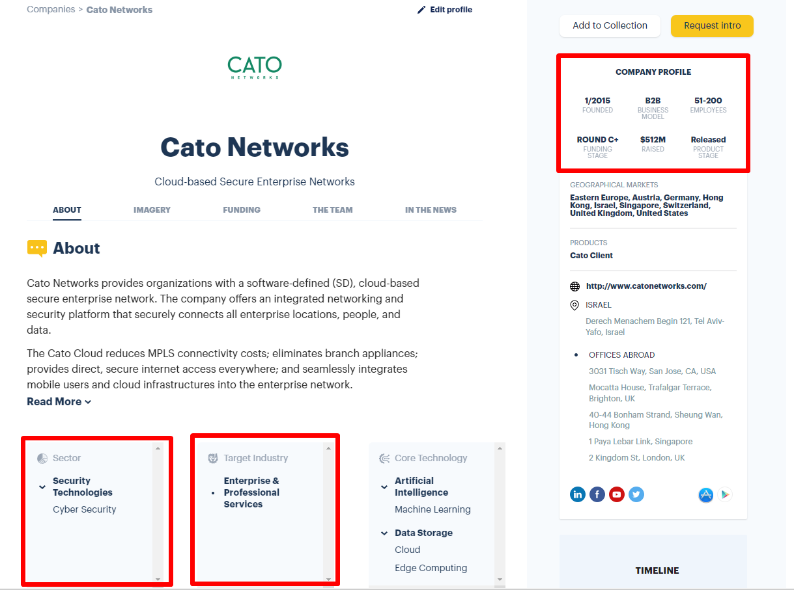
<div style="font-size: 35px; text-decoration: underline;"></div>

<div style="font-size: 35px; text-decoration: underline;">COMPANY PROFILE data and HTML locators</div>


<div style="font-size: 35px; text-decoration: underline;"></div>

<div style="font-size: 35px; text-decoration: underline;">COMPANY FOUNDERS and Funding rounds timeline</div>

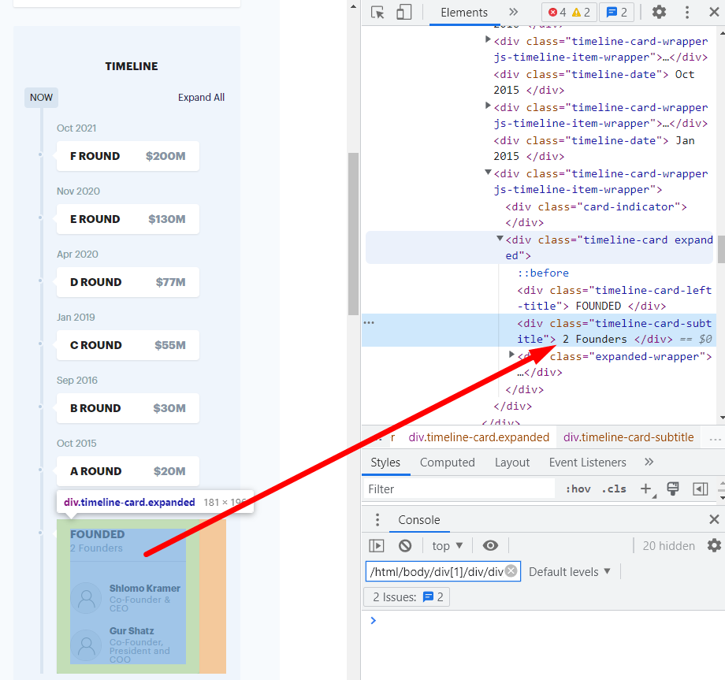

### Now, we are going run in a loop, each iteration will include 100 companies data extracting and we will wait a few seconds so we wont get blocked.
### Each iteration is saved in a seperate DataFrame so we can be in control all the time and check the data we are getting. (this step lasted about 48 hours)


```python
for i in range(0,104):
    df_res = get_df_companies(df.iloc[i*100: (i+1) * 100])
    df_res.to_csv("Data\companies_df\companies_" + str(i*100) + "-" + str((i*100) + 99) + ".csv",index = False)
    print("************************ file number:" + str(i) + "***********************\n\n")
    time.sleep(10)
```

### Now after we finished scraping all of the data, lets combine all the files to one big DataFrame :


```python
path = r'Data\companies_df'
all_files = sorted(glob.glob(os.path.join(path, "*.csv")), key=os.path.getmtime) #get all files sorted by time modified asc 

df_from_each_file = (pd.read_csv(f) for f in all_files)
concatenated_df = pd.concat(df_from_each_file, ignore_index=True)
# concatenated_df
```


```python
filepath = r'Data\companies_df\main_df.csv'
concatenated_df.to_csv(filepath, index=False)

```

# 2. Data cleaning  🧹🧹🧹 

<div style="font-size: 18px">After the scraping process we need to start the cleaning process.</div>


```python
main_df = pd.read_csv('Data/companies_df/main_df.csv')
```


```python
main_df
```


<div>
<style scoped>
    .dataframe tbody tr th:only-of-type {
        vertical-align: middle;
    }

    .dataframe tbody tr th {
        vertical-align: top;
    }

    .dataframe thead th {
        text-align: right;
    }
</style>
<table border="1" class="dataframe">
  <thead>
    <tr style="text-align: right;">
      <th></th>
      <th>COMPANIE_NAME</th>
      <th>FOUNDED</th>
      <th>BUSINESS_MODEL</th>
      <th>EMPLOYEES</th>
      <th>FUNDING_STAGE</th>
      <th>RAISED</th>
      <th>PRODUCT_STAGE</th>
      <th>NEWS_COUNT</th>
      <th>FOUNDER_COUNT</th>
      <th>TOTAL_ROUNDS</th>
      <th>INVESTORS_COUNT</th>
      <th>COMPANY_STATUS</th>
      <th>IS_ACADEMIC</th>
      <th>SECTOR</th>
      <th>TARGET_INDUSTORY</th>
    </tr>
  </thead>
  <tbody>
    <tr>
      <th>0</th>
      <td>Golan Plastic Products</td>
      <td>1/1964</td>
      <td>B2B, B2G</td>
      <td>11-50</td>
      <td>Public</td>
      <td>0</td>
      <td>Released</td>
      <td>1</td>
      <td>4</td>
      <td>0</td>
      <td>0</td>
      <td>Public</td>
      <td>0</td>
      <td>Industrial Technologies</td>
      <td>Energy, Utilities &amp; Waste Management</td>
    </tr>
    <tr>
      <th>1</th>
      <td>Cham Foods</td>
      <td>12/1970</td>
      <td>B2B, B2B2C</td>
      <td>11-50</td>
      <td>Public</td>
      <td>0</td>
      <td>Released</td>
      <td>2</td>
      <td>2</td>
      <td>0</td>
      <td>0</td>
      <td>Public</td>
      <td>0</td>
      <td>AgriFood-tech &amp; Water</td>
      <td>Agriculture &amp; Food</td>
    </tr>
    <tr>
      <th>2</th>
      <td>HerbaMed</td>
      <td>1/1986</td>
      <td>B2B, B2C</td>
      <td>1-10</td>
      <td>Revenue Financed</td>
      <td>0</td>
      <td>Released</td>
      <td>2</td>
      <td>2</td>
      <td>0</td>
      <td>0</td>
      <td>Not Active</td>
      <td>0</td>
      <td>AgriFood-tech &amp; Water</td>
      <td>Agriculture &amp; Food</td>
    </tr>
    <tr>
      <th>3</th>
      <td>RAD</td>
      <td>1/1981</td>
      <td>B2B, B2G</td>
      <td>500+</td>
      <td>Established</td>
      <td>0</td>
      <td>Released</td>
      <td>13</td>
      <td>3</td>
      <td>0</td>
      <td>0</td>
      <td>Active</td>
      <td>0</td>
      <td>Industrial Technologies</td>
      <td>Communication Services</td>
    </tr>
    <tr>
      <th>4</th>
      <td>RADA</td>
      <td>12/1970</td>
      <td>B2B, B2G</td>
      <td>201-500</td>
      <td>Public</td>
      <td>$35.3M</td>
      <td>Released</td>
      <td>31</td>
      <td>6</td>
      <td>2</td>
      <td>5</td>
      <td>Public</td>
      <td>0</td>
      <td>Security Technologies</td>
      <td>Defense, Safety &amp; Security</td>
    </tr>
    <tr>
      <th>...</th>
      <td>...</td>
      <td>...</td>
      <td>...</td>
      <td>...</td>
      <td>...</td>
      <td>...</td>
      <td>...</td>
      <td>...</td>
      <td>...</td>
      <td>...</td>
      <td>...</td>
      <td>...</td>
      <td>...</td>
      <td>...</td>
      <td>...</td>
    </tr>
    <tr>
      <th>10373</th>
      <td>Expecting</td>
      <td>1/2021</td>
      <td>B2B, B2C</td>
      <td>11-50</td>
      <td>Seed</td>
      <td>$1M</td>
      <td>Released</td>
      <td>2</td>
      <td>2</td>
      <td>1</td>
      <td>0</td>
      <td>Active</td>
      <td>0</td>
      <td>Life Sciences &amp; HealthTech</td>
      <td>Consumers</td>
    </tr>
    <tr>
      <th>10374</th>
      <td>Loona</td>
      <td>8/2020</td>
      <td>B2B</td>
      <td>1-10</td>
      <td>Bootstrapped</td>
      <td>0</td>
      <td>Customer development</td>
      <td>0</td>
      <td>2</td>
      <td>0</td>
      <td>0</td>
      <td>Active</td>
      <td>0</td>
      <td>Enterprise, IT &amp; Data Infrastructure</td>
      <td>Industrial Manufacturing</td>
    </tr>
    <tr>
      <th>10375</th>
      <td>Quiz Beez</td>
      <td>6/2021</td>
      <td>B2C</td>
      <td>1-10</td>
      <td>Bootstrapped</td>
      <td>0</td>
      <td>Customer development</td>
      <td>0</td>
      <td>1</td>
      <td>0</td>
      <td>0</td>
      <td>Active</td>
      <td>0</td>
      <td>Content &amp; Media</td>
      <td>Education</td>
    </tr>
    <tr>
      <th>10376</th>
      <td>Eureka Security</td>
      <td>10/2021</td>
      <td>B2B</td>
      <td>11-50</td>
      <td>Seed</td>
      <td>$8M</td>
      <td>Released</td>
      <td>2</td>
      <td>2</td>
      <td>1</td>
      <td>7</td>
      <td>Active</td>
      <td>0</td>
      <td>Security Technologies</td>
      <td>Enterprise &amp; Professional Services</td>
    </tr>
    <tr>
      <th>10377</th>
      <td>Kitchezz</td>
      <td>11/2020</td>
      <td>B2B, B2C</td>
      <td>1-10</td>
      <td>Bootstrapped</td>
      <td>0</td>
      <td>Released</td>
      <td>0</td>
      <td>2</td>
      <td>0</td>
      <td>0</td>
      <td>Active</td>
      <td>0</td>
      <td>Retail &amp; Marketing</td>
      <td>Commerce &amp; Retail</td>
    </tr>
  </tbody>
</table>
<p>10378 rows × 15 columns</p>
</div>


<div style="font-size: 18px">First, Let's look at none values for our companies.<br>
We can see that we have up to 709 None values in some columns, so we will start our data cleaning by using dropna.</div>


```python
main_df.isnull().sum(axis = 0)
```


    COMPANIE_NAME         0
    FOUNDED             376
    BUSINESS_MODEL      467
    EMPLOYEES           408
    FUNDING_STAGE       709
    RAISED                0
    PRODUCT_STAGE       569
    NEWS_COUNT            0
    FOUNDER_COUNT         0
    TOTAL_ROUNDS          0
    INVESTORS_COUNT       0
    COMPANY_STATUS        0
    IS_ACADEMIC           0
    SECTOR              343
    TARGET_INDUSTORY    394
    dtype: int64


```python
main_df.dropna(inplace=True)
print(main_df.isnull().sum(axis = 0))
print(len(main_df))
```

    COMPANIE_NAME       0
    FOUNDED             0
    BUSINESS_MODEL      0
    EMPLOYEES           0
    FUNDING_STAGE       0
    RAISED              0
    PRODUCT_STAGE       0
    NEWS_COUNT          0
    FOUNDER_COUNT       0
    TOTAL_ROUNDS        0
    INVESTORS_COUNT     0
    COMPANY_STATUS      0
    IS_ACADEMIC         0
    SECTOR              0
    TARGET_INDUSTORY    0
    dtype: int64
    9210
    

<div style="font-size: 18px">Second, lets see if we can drop duplicate rows.<br>
After removing Nan values we got total of 9210 rows.</div>


```python
main_df.drop_duplicates()
```


<div>
<style scoped>
    .dataframe tbody tr th:only-of-type {
        vertical-align: middle;
    }

    .dataframe tbody tr th {
        vertical-align: top;
    }

    .dataframe thead th {
        text-align: right;
    }
</style>
<table border="1" class="dataframe">
  <thead>
    <tr style="text-align: right;">
      <th></th>
      <th>COMPANIE_NAME</th>
      <th>FOUNDED</th>
      <th>BUSINESS_MODEL</th>
      <th>EMPLOYEES</th>
      <th>FUNDING_STAGE</th>
      <th>RAISED</th>
      <th>PRODUCT_STAGE</th>
      <th>NEWS_COUNT</th>
      <th>FOUNDER_COUNT</th>
      <th>TOTAL_ROUNDS</th>
      <th>INVESTORS_COUNT</th>
      <th>COMPANY_STATUS</th>
      <th>IS_ACADEMIC</th>
      <th>SECTOR</th>
      <th>TARGET_INDUSTORY</th>
    </tr>
  </thead>
  <tbody>
    <tr>
      <th>0</th>
      <td>Golan Plastic Products</td>
      <td>1/1964</td>
      <td>B2B, B2G</td>
      <td>11-50</td>
      <td>Public</td>
      <td>0</td>
      <td>Released</td>
      <td>1</td>
      <td>4</td>
      <td>0</td>
      <td>0</td>
      <td>Public</td>
      <td>0</td>
      <td>Industrial Technologies</td>
      <td>Energy, Utilities &amp; Waste Management</td>
    </tr>
    <tr>
      <th>1</th>
      <td>Cham Foods</td>
      <td>12/1970</td>
      <td>B2B, B2B2C</td>
      <td>11-50</td>
      <td>Public</td>
      <td>0</td>
      <td>Released</td>
      <td>2</td>
      <td>2</td>
      <td>0</td>
      <td>0</td>
      <td>Public</td>
      <td>0</td>
      <td>AgriFood-tech &amp; Water</td>
      <td>Agriculture &amp; Food</td>
    </tr>
    <tr>
      <th>2</th>
      <td>HerbaMed</td>
      <td>1/1986</td>
      <td>B2B, B2C</td>
      <td>1-10</td>
      <td>Revenue Financed</td>
      <td>0</td>
      <td>Released</td>
      <td>2</td>
      <td>2</td>
      <td>0</td>
      <td>0</td>
      <td>Not Active</td>
      <td>0</td>
      <td>AgriFood-tech &amp; Water</td>
      <td>Agriculture &amp; Food</td>
    </tr>
    <tr>
      <th>3</th>
      <td>RAD</td>
      <td>1/1981</td>
      <td>B2B, B2G</td>
      <td>500+</td>
      <td>Established</td>
      <td>0</td>
      <td>Released</td>
      <td>13</td>
      <td>3</td>
      <td>0</td>
      <td>0</td>
      <td>Active</td>
      <td>0</td>
      <td>Industrial Technologies</td>
      <td>Communication Services</td>
    </tr>
    <tr>
      <th>4</th>
      <td>RADA</td>
      <td>12/1970</td>
      <td>B2B, B2G</td>
      <td>201-500</td>
      <td>Public</td>
      <td>$35.3M</td>
      <td>Released</td>
      <td>31</td>
      <td>6</td>
      <td>2</td>
      <td>5</td>
      <td>Public</td>
      <td>0</td>
      <td>Security Technologies</td>
      <td>Defense, Safety &amp; Security</td>
    </tr>
    <tr>
      <th>...</th>
      <td>...</td>
      <td>...</td>
      <td>...</td>
      <td>...</td>
      <td>...</td>
      <td>...</td>
      <td>...</td>
      <td>...</td>
      <td>...</td>
      <td>...</td>
      <td>...</td>
      <td>...</td>
      <td>...</td>
      <td>...</td>
      <td>...</td>
    </tr>
    <tr>
      <th>10373</th>
      <td>Expecting</td>
      <td>1/2021</td>
      <td>B2B, B2C</td>
      <td>11-50</td>
      <td>Seed</td>
      <td>$1M</td>
      <td>Released</td>
      <td>2</td>
      <td>2</td>
      <td>1</td>
      <td>0</td>
      <td>Active</td>
      <td>0</td>
      <td>Life Sciences &amp; HealthTech</td>
      <td>Consumers</td>
    </tr>
    <tr>
      <th>10374</th>
      <td>Loona</td>
      <td>8/2020</td>
      <td>B2B</td>
      <td>1-10</td>
      <td>Bootstrapped</td>
      <td>0</td>
      <td>Customer development</td>
      <td>0</td>
      <td>2</td>
      <td>0</td>
      <td>0</td>
      <td>Active</td>
      <td>0</td>
      <td>Enterprise, IT &amp; Data Infrastructure</td>
      <td>Industrial Manufacturing</td>
    </tr>
    <tr>
      <th>10375</th>
      <td>Quiz Beez</td>
      <td>6/2021</td>
      <td>B2C</td>
      <td>1-10</td>
      <td>Bootstrapped</td>
      <td>0</td>
      <td>Customer development</td>
      <td>0</td>
      <td>1</td>
      <td>0</td>
      <td>0</td>
      <td>Active</td>
      <td>0</td>
      <td>Content &amp; Media</td>
      <td>Education</td>
    </tr>
    <tr>
      <th>10376</th>
      <td>Eureka Security</td>
      <td>10/2021</td>
      <td>B2B</td>
      <td>11-50</td>
      <td>Seed</td>
      <td>$8M</td>
      <td>Released</td>
      <td>2</td>
      <td>2</td>
      <td>1</td>
      <td>7</td>
      <td>Active</td>
      <td>0</td>
      <td>Security Technologies</td>
      <td>Enterprise &amp; Professional Services</td>
    </tr>
    <tr>
      <th>10377</th>
      <td>Kitchezz</td>
      <td>11/2020</td>
      <td>B2B, B2C</td>
      <td>1-10</td>
      <td>Bootstrapped</td>
      <td>0</td>
      <td>Released</td>
      <td>0</td>
      <td>2</td>
      <td>0</td>
      <td>0</td>
      <td>Active</td>
      <td>0</td>
      <td>Retail &amp; Marketing</td>
      <td>Commerce &amp; Retail</td>
    </tr>
  </tbody>
</table>
<p>9210 rows × 15 columns</p>
</div>


### We can see that after drop_duplicates function we still have 9210 rows which means our data scraping done optimally!!!

<div style="font-size: 18px">Now, because our 'RAISED' feature is not numeric, we need to transform our 'RAISED' value from string to int when we take into account the meaning of the letters ('K', 'M', 'B').</div>


```python
d = {'K': 3,'M': 6,'B': 9}
def text_to_num(text):
    if text == '0':return 0
    if text[-1] in d:
        num, magnitude = text[1:-1], text[-1]
        return int(float(num) * 10 ** d[magnitude])
    else:
        return int(0)
```


```python
for idx, row in main_df.iterrows():
    raised = text_to_num(row['RAISED'])
    main_df.at[idx,'RAISED'] = raised

```


```python
main_df["RAISED"] = pd.to_numeric(main_df["RAISED"])
main_df["RAISED"].describe().apply(lambda x: format(x, 'f'))
```


    count          9210.000000
    mean        9480790.375136
    std        49695496.790866
    min               0.000000
    25%               0.000000
    50%               0.000000
    75%         1199000.000000
    max      1247000000.000000
    Name: RAISED, dtype: object


<div style="font-size: 20px">
Now, lets extract our month and year from 'FUNDED' feature which looks like this "10/2021".<br>
We need to seperate month and year from each string and push them into our dataframe.</div>


```python
def extract_month_and_year(val):
    lst = val.split('/')
    if len(lst) == 1:
        lst.insert(0,0)
    return int(lst[0]),int(lst[1])

```


```python
months = list()
years = list()
for idx, row in main_df.iterrows():
    month,year = extract_month_and_year(row['FOUNDED'])
    months.append(month)
    years.append(year)
main_df.insert(loc=2, column='FOUNDED_MONTH', value=months) 
main_df.insert(loc=3, column='FOUNDED_YEAR', value=years) 
main_df.drop(columns = ['FOUNDED'], axis=1, inplace=True)
```

<div style="font-size: 18px">Let's have a look at our numeric features : </div>


```python
main_df.describe()
```


<div>
<style scoped>
    .dataframe tbody tr th:only-of-type {
        vertical-align: middle;
    }

    .dataframe tbody tr th {
        vertical-align: top;
    }

    .dataframe thead th {
        text-align: right;
    }
</style>
<table border="1" class="dataframe">
  <thead>
    <tr style="text-align: right;">
      <th></th>
      <th>FOUNDED_MONTH</th>
      <th>FOUNDED_YEAR</th>
      <th>RAISED</th>
      <th>NEWS_COUNT</th>
      <th>FOUNDER_COUNT</th>
      <th>TOTAL_ROUNDS</th>
      <th>INVESTORS_COUNT</th>
      <th>IS_ACADEMIC</th>
    </tr>
  </thead>
  <tbody>
    <tr>
      <th>count</th>
      <td>9210.000000</td>
      <td>9210.000000</td>
      <td>9.210000e+03</td>
      <td>9210.000000</td>
      <td>9210.000000</td>
      <td>9210.000000</td>
      <td>9210.000000</td>
      <td>9210.0</td>
    </tr>
    <tr>
      <th>mean</th>
      <td>4.998697</td>
      <td>2011.541151</td>
      <td>9.480790e+06</td>
      <td>2.831813</td>
      <td>2.618675</td>
      <td>0.930293</td>
      <td>1.358958</td>
      <td>0.0</td>
    </tr>
    <tr>
      <th>std</th>
      <td>3.775316</td>
      <td>9.305594</td>
      <td>4.969550e+07</td>
      <td>5.668288</td>
      <td>1.685656</td>
      <td>1.505888</td>
      <td>2.841590</td>
      <td>0.0</td>
    </tr>
    <tr>
      <th>min</th>
      <td>0.000000</td>
      <td>1950.000000</td>
      <td>0.000000e+00</td>
      <td>0.000000</td>
      <td>0.000000</td>
      <td>0.000000</td>
      <td>0.000000</td>
      <td>0.0</td>
    </tr>
    <tr>
      <th>25%</th>
      <td>1.000000</td>
      <td>2010.000000</td>
      <td>0.000000e+00</td>
      <td>0.000000</td>
      <td>1.250000</td>
      <td>0.000000</td>
      <td>0.000000</td>
      <td>0.0</td>
    </tr>
    <tr>
      <th>50%</th>
      <td>5.000000</td>
      <td>2014.000000</td>
      <td>0.000000e+00</td>
      <td>1.000000</td>
      <td>2.000000</td>
      <td>0.000000</td>
      <td>0.000000</td>
      <td>0.0</td>
    </tr>
    <tr>
      <th>75%</th>
      <td>8.000000</td>
      <td>2017.000000</td>
      <td>1.199000e+06</td>
      <td>3.000000</td>
      <td>3.000000</td>
      <td>1.000000</td>
      <td>1.000000</td>
      <td>0.0</td>
    </tr>
    <tr>
      <th>max</th>
      <td>12.000000</td>
      <td>2022.000000</td>
      <td>1.247000e+09</td>
      <td>98.000000</td>
      <td>41.000000</td>
      <td>16.000000</td>
      <td>32.000000</td>
      <td>0.0</td>
    </tr>
  </tbody>
</table>
</div>


<div style="font-size: 18px">Now we have categorical feature 'BUSINESS_MODEL' that we want to transform to numeric true\false columns :<br>
Buisness model feature has 4 possible categories when there are companies that are characterized by several different models.</div>


```python
def extract_business_model(main_df):
    b2b = list()
    b2c = list()
    b2g = list()
    b2b2c = list()
    for model in main_df['BUSINESS_MODEL']:
        lst = model.split(', ')
        b2b.append('B2B' in lst)
        b2c.append('B2C' in lst)
        b2g.append('B2G' in lst)
        b2b2c.append('B2B2C' in lst)
            
    return b2b, b2c, b2g ,b2b2c
    
    
```


```python
b2b, b2c, b2g ,b2b2c = extract_business_model(main_df)
main_df.insert(loc=4, column='B2B', value=b2b) 
main_df.insert(loc=5, column='B2C', value=b2c) 
main_df.insert(loc=6, column='B2G', value=b2g) 
main_df.insert(loc=7, column='B2B2C', value=b2b2c) 
```


```python
main_df['B2B'] = np.where(main_df['B2B'],1,0)
main_df['B2C'] = np.where(main_df['B2C'],1,0)
main_df['B2G'] = np.where(main_df['B2G'],1,0)
main_df['B2B2C'] = np.where(main_df['B2B2C'],1,0)
main_df.drop(columns = ['BUSINESS_MODEL'], axis=1, inplace=True)
```

<div style="font-size: 18px">'COMPANY_STATUS' is also categorical feature and we want to transform it to numeric true\false columns :<br>
</div>


```python
def extract_company_status(main_df):
    is_public = list()
    is_acquired = list()
    is_active = list()
    is_notActive = list()
    for status in main_df['COMPANY_STATUS']:
        is_public.append('Public' == status)
        is_acquired.append('Acquired' == status)
        is_active.append('Active' == status)
        is_notActive.append('Not Active' == status)
    
    is_public = np.where(is_public,1,0)
    is_acquired = np.where(is_acquired,1,0)
    is_active = np.where(is_active,1,0)
    is_notActive = np.where(is_notActive,1,0)
    
    return is_public, is_acquired, is_active ,is_notActive
```


```python
is_public, is_acquired, is_active ,is_notActive = extract_company_status(main_df)
main_df.insert(loc=16, column='IS_PUBLIC', value=is_public) 
main_df.insert(loc=17, column='IS_ACQUIRED', value=is_acquired) 
main_df.insert(loc=18, column='IS_ACTIVE', value=is_active) 
main_df.insert(loc=19, column='IS_NOT_ACTIVE', value=is_notActive)
main_df.drop(columns = ['COMPANY_STATUS'], axis=1, inplace=True)
```

## Let's see what we got so far :


```python
main_df
```


<div>
<style scoped>
    .dataframe tbody tr th:only-of-type {
        vertical-align: middle;
    }

    .dataframe tbody tr th {
        vertical-align: top;
    }

    .dataframe thead th {
        text-align: right;
    }
</style>
<table border="1" class="dataframe">
  <thead>
    <tr style="text-align: right;">
      <th></th>
      <th>COMPANIE_NAME</th>
      <th>FOUNDED_MONTH</th>
      <th>FOUNDED_YEAR</th>
      <th>B2B</th>
      <th>B2C</th>
      <th>B2G</th>
      <th>B2B2C</th>
      <th>EMPLOYEES</th>
      <th>FUNDING_STAGE</th>
      <th>RAISED</th>
      <th>...</th>
      <th>FOUNDER_COUNT</th>
      <th>TOTAL_ROUNDS</th>
      <th>INVESTORS_COUNT</th>
      <th>IS_PUBLIC</th>
      <th>IS_ACQUIRED</th>
      <th>IS_ACTIVE</th>
      <th>IS_NOT_ACTIVE</th>
      <th>IS_ACADEMIC</th>
      <th>SECTOR</th>
      <th>TARGET_INDUSTORY</th>
    </tr>
  </thead>
  <tbody>
    <tr>
      <th>0</th>
      <td>Golan Plastic Products</td>
      <td>1</td>
      <td>1964</td>
      <td>1</td>
      <td>0</td>
      <td>1</td>
      <td>0</td>
      <td>11-50</td>
      <td>Public</td>
      <td>0</td>
      <td>...</td>
      <td>4</td>
      <td>0</td>
      <td>0</td>
      <td>1</td>
      <td>0</td>
      <td>0</td>
      <td>0</td>
      <td>0</td>
      <td>Industrial Technologies</td>
      <td>Energy, Utilities &amp; Waste Management</td>
    </tr>
    <tr>
      <th>1</th>
      <td>Cham Foods</td>
      <td>12</td>
      <td>1970</td>
      <td>1</td>
      <td>0</td>
      <td>0</td>
      <td>1</td>
      <td>11-50</td>
      <td>Public</td>
      <td>0</td>
      <td>...</td>
      <td>2</td>
      <td>0</td>
      <td>0</td>
      <td>1</td>
      <td>0</td>
      <td>0</td>
      <td>0</td>
      <td>0</td>
      <td>AgriFood-tech &amp; Water</td>
      <td>Agriculture &amp; Food</td>
    </tr>
    <tr>
      <th>2</th>
      <td>HerbaMed</td>
      <td>1</td>
      <td>1986</td>
      <td>1</td>
      <td>1</td>
      <td>0</td>
      <td>0</td>
      <td>1-10</td>
      <td>Revenue Financed</td>
      <td>0</td>
      <td>...</td>
      <td>2</td>
      <td>0</td>
      <td>0</td>
      <td>0</td>
      <td>0</td>
      <td>0</td>
      <td>1</td>
      <td>0</td>
      <td>AgriFood-tech &amp; Water</td>
      <td>Agriculture &amp; Food</td>
    </tr>
    <tr>
      <th>3</th>
      <td>RAD</td>
      <td>1</td>
      <td>1981</td>
      <td>1</td>
      <td>0</td>
      <td>1</td>
      <td>0</td>
      <td>500+</td>
      <td>Established</td>
      <td>0</td>
      <td>...</td>
      <td>3</td>
      <td>0</td>
      <td>0</td>
      <td>0</td>
      <td>0</td>
      <td>1</td>
      <td>0</td>
      <td>0</td>
      <td>Industrial Technologies</td>
      <td>Communication Services</td>
    </tr>
    <tr>
      <th>4</th>
      <td>RADA</td>
      <td>12</td>
      <td>1970</td>
      <td>1</td>
      <td>0</td>
      <td>1</td>
      <td>0</td>
      <td>201-500</td>
      <td>Public</td>
      <td>35300000</td>
      <td>...</td>
      <td>6</td>
      <td>2</td>
      <td>5</td>
      <td>1</td>
      <td>0</td>
      <td>0</td>
      <td>0</td>
      <td>0</td>
      <td>Security Technologies</td>
      <td>Defense, Safety &amp; Security</td>
    </tr>
    <tr>
      <th>...</th>
      <td>...</td>
      <td>...</td>
      <td>...</td>
      <td>...</td>
      <td>...</td>
      <td>...</td>
      <td>...</td>
      <td>...</td>
      <td>...</td>
      <td>...</td>
      <td>...</td>
      <td>...</td>
      <td>...</td>
      <td>...</td>
      <td>...</td>
      <td>...</td>
      <td>...</td>
      <td>...</td>
      <td>...</td>
      <td>...</td>
      <td>...</td>
    </tr>
    <tr>
      <th>10373</th>
      <td>Expecting</td>
      <td>1</td>
      <td>2021</td>
      <td>1</td>
      <td>1</td>
      <td>0</td>
      <td>0</td>
      <td>11-50</td>
      <td>Seed</td>
      <td>1000000</td>
      <td>...</td>
      <td>2</td>
      <td>1</td>
      <td>0</td>
      <td>0</td>
      <td>0</td>
      <td>1</td>
      <td>0</td>
      <td>0</td>
      <td>Life Sciences &amp; HealthTech</td>
      <td>Consumers</td>
    </tr>
    <tr>
      <th>10374</th>
      <td>Loona</td>
      <td>8</td>
      <td>2020</td>
      <td>1</td>
      <td>0</td>
      <td>0</td>
      <td>0</td>
      <td>1-10</td>
      <td>Bootstrapped</td>
      <td>0</td>
      <td>...</td>
      <td>2</td>
      <td>0</td>
      <td>0</td>
      <td>0</td>
      <td>0</td>
      <td>1</td>
      <td>0</td>
      <td>0</td>
      <td>Enterprise, IT &amp; Data Infrastructure</td>
      <td>Industrial Manufacturing</td>
    </tr>
    <tr>
      <th>10375</th>
      <td>Quiz Beez</td>
      <td>6</td>
      <td>2021</td>
      <td>0</td>
      <td>1</td>
      <td>0</td>
      <td>0</td>
      <td>1-10</td>
      <td>Bootstrapped</td>
      <td>0</td>
      <td>...</td>
      <td>1</td>
      <td>0</td>
      <td>0</td>
      <td>0</td>
      <td>0</td>
      <td>1</td>
      <td>0</td>
      <td>0</td>
      <td>Content &amp; Media</td>
      <td>Education</td>
    </tr>
    <tr>
      <th>10376</th>
      <td>Eureka Security</td>
      <td>10</td>
      <td>2021</td>
      <td>1</td>
      <td>0</td>
      <td>0</td>
      <td>0</td>
      <td>11-50</td>
      <td>Seed</td>
      <td>8000000</td>
      <td>...</td>
      <td>2</td>
      <td>1</td>
      <td>7</td>
      <td>0</td>
      <td>0</td>
      <td>1</td>
      <td>0</td>
      <td>0</td>
      <td>Security Technologies</td>
      <td>Enterprise &amp; Professional Services</td>
    </tr>
    <tr>
      <th>10377</th>
      <td>Kitchezz</td>
      <td>11</td>
      <td>2020</td>
      <td>1</td>
      <td>1</td>
      <td>0</td>
      <td>0</td>
      <td>1-10</td>
      <td>Bootstrapped</td>
      <td>0</td>
      <td>...</td>
      <td>2</td>
      <td>0</td>
      <td>0</td>
      <td>0</td>
      <td>0</td>
      <td>1</td>
      <td>0</td>
      <td>0</td>
      <td>Retail &amp; Marketing</td>
      <td>Commerce &amp; Retail</td>
    </tr>
  </tbody>
</table>
<p>9210 rows × 22 columns</p>
</div>


```python
main_df.describe(include='all')
```


<div>
<style scoped>
    .dataframe tbody tr th:only-of-type {
        vertical-align: middle;
    }

    .dataframe tbody tr th {
        vertical-align: top;
    }

    .dataframe thead th {
        text-align: right;
    }
</style>
<table border="1" class="dataframe">
  <thead>
    <tr style="text-align: right;">
      <th></th>
      <th>COMPANIE_NAME</th>
      <th>FOUNDED_MONTH</th>
      <th>FOUNDED_YEAR</th>
      <th>B2B</th>
      <th>B2C</th>
      <th>B2G</th>
      <th>B2B2C</th>
      <th>EMPLOYEES</th>
      <th>FUNDING_STAGE</th>
      <th>RAISED</th>
      <th>...</th>
      <th>FOUNDER_COUNT</th>
      <th>TOTAL_ROUNDS</th>
      <th>INVESTORS_COUNT</th>
      <th>IS_PUBLIC</th>
      <th>IS_ACQUIRED</th>
      <th>IS_ACTIVE</th>
      <th>IS_NOT_ACTIVE</th>
      <th>IS_ACADEMIC</th>
      <th>SECTOR</th>
      <th>TARGET_INDUSTORY</th>
    </tr>
  </thead>
  <tbody>
    <tr>
      <th>count</th>
      <td>9210</td>
      <td>9210.000000</td>
      <td>9210.000000</td>
      <td>9210.000000</td>
      <td>9210.000000</td>
      <td>9210.000000</td>
      <td>9210.000000</td>
      <td>9210</td>
      <td>9210</td>
      <td>9.210000e+03</td>
      <td>...</td>
      <td>9210.000000</td>
      <td>9210.000000</td>
      <td>9210.000000</td>
      <td>9210.000000</td>
      <td>9210.000000</td>
      <td>9210.000000</td>
      <td>9210.000000</td>
      <td>9210.0</td>
      <td>9210</td>
      <td>9210</td>
    </tr>
    <tr>
      <th>unique</th>
      <td>9199</td>
      <td>NaN</td>
      <td>NaN</td>
      <td>NaN</td>
      <td>NaN</td>
      <td>NaN</td>
      <td>NaN</td>
      <td>5</td>
      <td>10</td>
      <td>NaN</td>
      <td>...</td>
      <td>NaN</td>
      <td>NaN</td>
      <td>NaN</td>
      <td>NaN</td>
      <td>NaN</td>
      <td>NaN</td>
      <td>NaN</td>
      <td>NaN</td>
      <td>11</td>
      <td>17</td>
    </tr>
    <tr>
      <th>top</th>
      <td>Amigo</td>
      <td>NaN</td>
      <td>NaN</td>
      <td>NaN</td>
      <td>NaN</td>
      <td>NaN</td>
      <td>NaN</td>
      <td>1-10</td>
      <td>Bootstrapped</td>
      <td>NaN</td>
      <td>...</td>
      <td>NaN</td>
      <td>NaN</td>
      <td>NaN</td>
      <td>NaN</td>
      <td>NaN</td>
      <td>NaN</td>
      <td>NaN</td>
      <td>NaN</td>
      <td>Life Sciences &amp; HealthTech</td>
      <td>Consumers</td>
    </tr>
    <tr>
      <th>freq</th>
      <td>2</td>
      <td>NaN</td>
      <td>NaN</td>
      <td>NaN</td>
      <td>NaN</td>
      <td>NaN</td>
      <td>NaN</td>
      <td>5694</td>
      <td>2655</td>
      <td>NaN</td>
      <td>...</td>
      <td>NaN</td>
      <td>NaN</td>
      <td>NaN</td>
      <td>NaN</td>
      <td>NaN</td>
      <td>NaN</td>
      <td>NaN</td>
      <td>NaN</td>
      <td>1660</td>
      <td>2640</td>
    </tr>
    <tr>
      <th>mean</th>
      <td>NaN</td>
      <td>4.998697</td>
      <td>2011.541151</td>
      <td>0.790662</td>
      <td>0.338436</td>
      <td>0.154397</td>
      <td>0.145168</td>
      <td>NaN</td>
      <td>NaN</td>
      <td>9.480790e+06</td>
      <td>...</td>
      <td>2.618675</td>
      <td>0.930293</td>
      <td>1.358958</td>
      <td>0.035722</td>
      <td>0.095331</td>
      <td>0.585125</td>
      <td>0.283822</td>
      <td>0.0</td>
      <td>NaN</td>
      <td>NaN</td>
    </tr>
    <tr>
      <th>std</th>
      <td>NaN</td>
      <td>3.775316</td>
      <td>9.305594</td>
      <td>0.406858</td>
      <td>0.473203</td>
      <td>0.361349</td>
      <td>0.352290</td>
      <td>NaN</td>
      <td>NaN</td>
      <td>4.969550e+07</td>
      <td>...</td>
      <td>1.685656</td>
      <td>1.505888</td>
      <td>2.841590</td>
      <td>0.185606</td>
      <td>0.293688</td>
      <td>0.492727</td>
      <td>0.450876</td>
      <td>0.0</td>
      <td>NaN</td>
      <td>NaN</td>
    </tr>
    <tr>
      <th>min</th>
      <td>NaN</td>
      <td>0.000000</td>
      <td>1950.000000</td>
      <td>0.000000</td>
      <td>0.000000</td>
      <td>0.000000</td>
      <td>0.000000</td>
      <td>NaN</td>
      <td>NaN</td>
      <td>0.000000e+00</td>
      <td>...</td>
      <td>0.000000</td>
      <td>0.000000</td>
      <td>0.000000</td>
      <td>0.000000</td>
      <td>0.000000</td>
      <td>0.000000</td>
      <td>0.000000</td>
      <td>0.0</td>
      <td>NaN</td>
      <td>NaN</td>
    </tr>
    <tr>
      <th>25%</th>
      <td>NaN</td>
      <td>1.000000</td>
      <td>2010.000000</td>
      <td>1.000000</td>
      <td>0.000000</td>
      <td>0.000000</td>
      <td>0.000000</td>
      <td>NaN</td>
      <td>NaN</td>
      <td>0.000000e+00</td>
      <td>...</td>
      <td>1.250000</td>
      <td>0.000000</td>
      <td>0.000000</td>
      <td>0.000000</td>
      <td>0.000000</td>
      <td>0.000000</td>
      <td>0.000000</td>
      <td>0.0</td>
      <td>NaN</td>
      <td>NaN</td>
    </tr>
    <tr>
      <th>50%</th>
      <td>NaN</td>
      <td>5.000000</td>
      <td>2014.000000</td>
      <td>1.000000</td>
      <td>0.000000</td>
      <td>0.000000</td>
      <td>0.000000</td>
      <td>NaN</td>
      <td>NaN</td>
      <td>0.000000e+00</td>
      <td>...</td>
      <td>2.000000</td>
      <td>0.000000</td>
      <td>0.000000</td>
      <td>0.000000</td>
      <td>0.000000</td>
      <td>1.000000</td>
      <td>0.000000</td>
      <td>0.0</td>
      <td>NaN</td>
      <td>NaN</td>
    </tr>
    <tr>
      <th>75%</th>
      <td>NaN</td>
      <td>8.000000</td>
      <td>2017.000000</td>
      <td>1.000000</td>
      <td>1.000000</td>
      <td>0.000000</td>
      <td>0.000000</td>
      <td>NaN</td>
      <td>NaN</td>
      <td>1.199000e+06</td>
      <td>...</td>
      <td>3.000000</td>
      <td>1.000000</td>
      <td>1.000000</td>
      <td>0.000000</td>
      <td>0.000000</td>
      <td>1.000000</td>
      <td>1.000000</td>
      <td>0.0</td>
      <td>NaN</td>
      <td>NaN</td>
    </tr>
    <tr>
      <th>max</th>
      <td>NaN</td>
      <td>12.000000</td>
      <td>2022.000000</td>
      <td>1.000000</td>
      <td>1.000000</td>
      <td>1.000000</td>
      <td>1.000000</td>
      <td>NaN</td>
      <td>NaN</td>
      <td>1.247000e+09</td>
      <td>...</td>
      <td>41.000000</td>
      <td>16.000000</td>
      <td>32.000000</td>
      <td>1.000000</td>
      <td>1.000000</td>
      <td>1.000000</td>
      <td>1.000000</td>
      <td>0.0</td>
      <td>NaN</td>
      <td>NaN</td>
    </tr>
  </tbody>
</table>
<p>11 rows × 22 columns</p>
</div>


<div style="font-size: 18px">We realized that 'IS_ACADEMIC' value is 0 for all the rows at this point, so we decided to drop the entire column.</div>


```python
print("Number of companies with IS_ACADEMIC = True :  ",sum(main_df['IS_ACADEMIC']==1))
main_df.drop(columns = ['IS_ACADEMIC'], axis=1, inplace=True)
```

    Number of companies with IS_ACADEMIC = True :   0
    

<div style="font-size: 18px">'FUNDING_STAGE', 'EMPLOYEES' and 'PRODUCT_STAGE' are categorical features and we want to convert their values to numeric categories<br> Let's look at our unique values : </div>


```python
print(main_df['FUNDING_STAGE'].unique())
print(main_df['EMPLOYEES'].unique())
print(main_df['PRODUCT_STAGE'].unique())
```

    ['Public' 'Revenue Financed' 'Established' 'ROUND A' 'ROUND C+' 'Acquired'
     'Seed' 'ROUND B' 'Bootstrapped' 'Pre-Seed']
    ['11-50' '1-10' '500+' '201-500' '51-200']
    ['Released' 'Clinical Trial' 'R&D' 'Beta' 'Alpha' 'Customer development']
    

<div style="font-size: 18px">Acuired is not a funding stage, therefore we need to drop 8 records where funding stage = acuired</div>


```python
len(main_df[main_df['FUNDING_STAGE'] == 'Acquired'].index)
```


    8


```python
main_df.drop(main_df[main_df.FUNDING_STAGE == 'Acquired'].index, inplace=True)
```

<div style="font-size: 18px">Because these features are ordinal categorical we want to order them by numerical order : </div>


```python
employees_replace_map = {'1-10': 0, '11-50': 1, '51-200': 2, '201-500': 3, '500+': 4}
main_df['EMPLOYEES'].replace(employees_replace_map, inplace=True)

funding_replace_map = {'Bootstrapped': 0, 'Pre-Seed': 1, 'Seed': 2, 'ROUND A': 3, 'ROUND B': 4, 'ROUND C+': 5, 'Public': 6, 'Revenue Financed': 7, 'Established': 8}
main_df['FUNDING_STAGE'].replace(funding_replace_map, inplace=True)

stage_replace_map = {'Customer development': 0, 'R&D': 1, 'Clinical Trial': 2, 'Alpha': 3, 'Beta': 4, 'Released': 5}
main_df['PRODUCT_STAGE'].replace(stage_replace_map, inplace=True)
```

<div style="font-size: 18px">'SECTOR' and 'TARGET_INDUSTORY' are not ordinal categorical so we can give them codes in any order.</div>


```python
sector_replace_map = dict( enumerate(main_df['SECTOR'].astype('category').cat.categories ))
main_df['SECTOR'].replace(sector_replace_map, inplace=True)
print(sector_replace_map)
target_replace_map = dict( enumerate(main_df['TARGET_INDUSTORY'].astype('category').cat.categories ))
main_df['TARGET_INDUSTORY'].replace(target_replace_map, inplace=True)
print(target_replace_map)

```

    {0: 'Aerospace & Aviation', 1: 'AgriFood-tech & Water', 2: 'Content & Media', 3: 'Energy-tech', 4: 'Enterprise, IT & Data Infrastructure', 5: 'FinTech', 6: 'Industrial Technologies', 7: 'Life Sciences & HealthTech', 8: 'Retail & Marketing', 9: 'Security Technologies', 10: 'Smart Mobility'}
    {0: 'Agriculture & Food', 1: 'Commerce & Retail', 2: 'Communication Services', 3: 'Consumers', 4: 'Defense, Safety & Security', 5: 'Education', 6: 'Energy, Utilities & Waste Management', 7: 'Enterprise & Professional Services', 8: 'Financial Services', 9: 'Food Retail & Consumption', 10: 'Government & City', 11: 'Healthcare & Life Sciences', 12: 'Industrial Manufacturing', 13: 'Media & Entertainment', 14: 'Real Estate & Construction', 15: 'Transportation & Logistics', 16: 'Travel & Tourism'}
    


```python
def get_age(year_list, month_list):
    age = list()
    for year, month in zip(year_list, month_list):
        age.append((2022 - year) * 365 + (6 - month) * 30)
    return age
```

<div style="font-size: 18px">We see that we have some months with 0 value so we will replace them with the mean value.</div>


```python
main_df.loc[main_df['FOUNDED_MONTH'] == 0, ['FOUNDED_MONTH']] = round(main_df['FOUNDED_MONTH'].mean())
```

<div style="font-size: 18px">And now lets add 'AGE' feature which means how old the company is in days. </div>


```python
age = get_age(main_df['FOUNDED_YEAR'], main_df['FOUNDED_MONTH'])
main_df.insert(loc=3, column='AGE', value=age) 
```


```python
main_df
```


<div>
<style scoped>
    .dataframe tbody tr th:only-of-type {
        vertical-align: middle;
    }

    .dataframe tbody tr th {
        vertical-align: top;
    }

    .dataframe thead th {
        text-align: right;
    }
</style>
<table border="1" class="dataframe">
  <thead>
    <tr style="text-align: right;">
      <th></th>
      <th>COMPANIE_NAME</th>
      <th>FOUNDED_MONTH</th>
      <th>FOUNDED_YEAR</th>
      <th>AGE</th>
      <th>B2B</th>
      <th>B2C</th>
      <th>B2G</th>
      <th>B2B2C</th>
      <th>EMPLOYEES</th>
      <th>FUNDING_STAGE</th>
      <th>...</th>
      <th>NEWS_COUNT</th>
      <th>FOUNDER_COUNT</th>
      <th>TOTAL_ROUNDS</th>
      <th>INVESTORS_COUNT</th>
      <th>IS_PUBLIC</th>
      <th>IS_ACQUIRED</th>
      <th>IS_ACTIVE</th>
      <th>IS_NOT_ACTIVE</th>
      <th>SECTOR</th>
      <th>TARGET_INDUSTORY</th>
    </tr>
  </thead>
  <tbody>
    <tr>
      <th>0</th>
      <td>Golan Plastic Products</td>
      <td>1</td>
      <td>1964</td>
      <td>21320</td>
      <td>1</td>
      <td>0</td>
      <td>1</td>
      <td>0</td>
      <td>1</td>
      <td>6</td>
      <td>...</td>
      <td>1</td>
      <td>4</td>
      <td>0</td>
      <td>0</td>
      <td>1</td>
      <td>0</td>
      <td>0</td>
      <td>0</td>
      <td>Industrial Technologies</td>
      <td>Energy, Utilities &amp; Waste Management</td>
    </tr>
    <tr>
      <th>1</th>
      <td>Cham Foods</td>
      <td>12</td>
      <td>1970</td>
      <td>18800</td>
      <td>1</td>
      <td>0</td>
      <td>0</td>
      <td>1</td>
      <td>1</td>
      <td>6</td>
      <td>...</td>
      <td>2</td>
      <td>2</td>
      <td>0</td>
      <td>0</td>
      <td>1</td>
      <td>0</td>
      <td>0</td>
      <td>0</td>
      <td>AgriFood-tech &amp; Water</td>
      <td>Agriculture &amp; Food</td>
    </tr>
    <tr>
      <th>2</th>
      <td>HerbaMed</td>
      <td>1</td>
      <td>1986</td>
      <td>13290</td>
      <td>1</td>
      <td>1</td>
      <td>0</td>
      <td>0</td>
      <td>0</td>
      <td>7</td>
      <td>...</td>
      <td>2</td>
      <td>2</td>
      <td>0</td>
      <td>0</td>
      <td>0</td>
      <td>0</td>
      <td>0</td>
      <td>1</td>
      <td>AgriFood-tech &amp; Water</td>
      <td>Agriculture &amp; Food</td>
    </tr>
    <tr>
      <th>3</th>
      <td>RAD</td>
      <td>1</td>
      <td>1981</td>
      <td>15115</td>
      <td>1</td>
      <td>0</td>
      <td>1</td>
      <td>0</td>
      <td>4</td>
      <td>8</td>
      <td>...</td>
      <td>13</td>
      <td>3</td>
      <td>0</td>
      <td>0</td>
      <td>0</td>
      <td>0</td>
      <td>1</td>
      <td>0</td>
      <td>Industrial Technologies</td>
      <td>Communication Services</td>
    </tr>
    <tr>
      <th>4</th>
      <td>RADA</td>
      <td>12</td>
      <td>1970</td>
      <td>18800</td>
      <td>1</td>
      <td>0</td>
      <td>1</td>
      <td>0</td>
      <td>3</td>
      <td>6</td>
      <td>...</td>
      <td>31</td>
      <td>6</td>
      <td>2</td>
      <td>5</td>
      <td>1</td>
      <td>0</td>
      <td>0</td>
      <td>0</td>
      <td>Security Technologies</td>
      <td>Defense, Safety &amp; Security</td>
    </tr>
    <tr>
      <th>...</th>
      <td>...</td>
      <td>...</td>
      <td>...</td>
      <td>...</td>
      <td>...</td>
      <td>...</td>
      <td>...</td>
      <td>...</td>
      <td>...</td>
      <td>...</td>
      <td>...</td>
      <td>...</td>
      <td>...</td>
      <td>...</td>
      <td>...</td>
      <td>...</td>
      <td>...</td>
      <td>...</td>
      <td>...</td>
      <td>...</td>
      <td>...</td>
    </tr>
    <tr>
      <th>10373</th>
      <td>Expecting</td>
      <td>1</td>
      <td>2021</td>
      <td>515</td>
      <td>1</td>
      <td>1</td>
      <td>0</td>
      <td>0</td>
      <td>1</td>
      <td>2</td>
      <td>...</td>
      <td>2</td>
      <td>2</td>
      <td>1</td>
      <td>0</td>
      <td>0</td>
      <td>0</td>
      <td>1</td>
      <td>0</td>
      <td>Life Sciences &amp; HealthTech</td>
      <td>Consumers</td>
    </tr>
    <tr>
      <th>10374</th>
      <td>Loona</td>
      <td>8</td>
      <td>2020</td>
      <td>670</td>
      <td>1</td>
      <td>0</td>
      <td>0</td>
      <td>0</td>
      <td>0</td>
      <td>0</td>
      <td>...</td>
      <td>0</td>
      <td>2</td>
      <td>0</td>
      <td>0</td>
      <td>0</td>
      <td>0</td>
      <td>1</td>
      <td>0</td>
      <td>Enterprise, IT &amp; Data Infrastructure</td>
      <td>Industrial Manufacturing</td>
    </tr>
    <tr>
      <th>10375</th>
      <td>Quiz Beez</td>
      <td>6</td>
      <td>2021</td>
      <td>365</td>
      <td>0</td>
      <td>1</td>
      <td>0</td>
      <td>0</td>
      <td>0</td>
      <td>0</td>
      <td>...</td>
      <td>0</td>
      <td>1</td>
      <td>0</td>
      <td>0</td>
      <td>0</td>
      <td>0</td>
      <td>1</td>
      <td>0</td>
      <td>Content &amp; Media</td>
      <td>Education</td>
    </tr>
    <tr>
      <th>10376</th>
      <td>Eureka Security</td>
      <td>10</td>
      <td>2021</td>
      <td>245</td>
      <td>1</td>
      <td>0</td>
      <td>0</td>
      <td>0</td>
      <td>1</td>
      <td>2</td>
      <td>...</td>
      <td>2</td>
      <td>2</td>
      <td>1</td>
      <td>7</td>
      <td>0</td>
      <td>0</td>
      <td>1</td>
      <td>0</td>
      <td>Security Technologies</td>
      <td>Enterprise &amp; Professional Services</td>
    </tr>
    <tr>
      <th>10377</th>
      <td>Kitchezz</td>
      <td>11</td>
      <td>2020</td>
      <td>580</td>
      <td>1</td>
      <td>1</td>
      <td>0</td>
      <td>0</td>
      <td>0</td>
      <td>0</td>
      <td>...</td>
      <td>0</td>
      <td>2</td>
      <td>0</td>
      <td>0</td>
      <td>0</td>
      <td>0</td>
      <td>1</td>
      <td>0</td>
      <td>Retail &amp; Marketing</td>
      <td>Commerce &amp; Retail</td>
    </tr>
  </tbody>
</table>
<p>9202 rows × 22 columns</p>
</div>


# 3. Outliers 🤥⛔

In this secion, we are going to:
* Detect Outliers and present them by using boxplots for the next features:
    * RAISED
    * NEWS_COUNT 
    * FOUNDER_COUNT
    * INVESTORS_COUNT
* We are going to use Z-score and IQR and select what seems best for us.


```python
sns.boxplot(main_df.RAISED)
plt.show()
sns.boxplot(main_df.NEWS_COUNT)
plt.show()
sns.boxplot(main_df.FOUNDER_COUNT)
plt.show()
sns.boxplot(main_df.INVESTORS_COUNT)
plt.show()
```


    
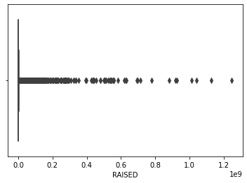
    


    
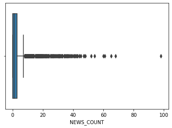
    


    
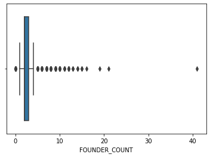
    


    
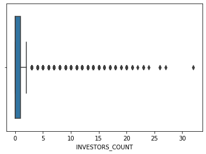
    


### 'RAISED'


```python
Q1 = np.percentile(main_df["RAISED"], 25)
Q3 = np.percentile(main_df["RAISED"], 75)
IQR = Q3 - Q1
print(f"IQR value: {IQR}\nQ1 value: {Q1}\nQ3 value: {Q3}")
Fare_outlier_rows = main_df[(main_df["RAISED"] < Q1 - 1.5*IQR) | (main_df["RAISED"] > Q3 + 1.5*IQR )].index
print("Total sum of outliers detected: ",len(Fare_outlier_rows))
```

    IQR value: 1200000.0
    Q1 value: 0.0
    Q3 value: 1200000.0
    Total sum of outliers detected:  1763
    

With IQR we got 1763 outliers which is too many, lets try z-score:


```python
z_score = (main_df["RAISED"] - main_df["RAISED"].mean()) / main_df["RAISED"].std()
outliers = abs(z_score) > 3
print("Total outliers: ", sum(outliers))
main_df.drop(main_df[outliers].index, axis=0, inplace=True)
print("110 outliers are much better for us so we will use z-score")
```

    Total outliers:  110
    110 outliers are much better for us so we will use z-score
    

### 'NEWS_COUNT'


```python
z_score = (main_df["NEWS_COUNT"] - main_df["NEWS_COUNT"].mean()) / main_df["NEWS_COUNT"].std()
outliers = abs(z_score) > 4
print("Total outliers: ", sum(outliers))
main_df.drop(main_df[outliers].index, axis=0, inplace=True)
```

    Total outliers:  111
    

### 'FOUNDER_COUNT'


```python
z_score = (main_df["FOUNDER_COUNT"] - main_df["FOUNDER_COUNT"].mean()) / main_df["FOUNDER_COUNT"].std()
outliers = abs(z_score) > 4
print("Total outliers: ", sum(outliers))
main_df.drop(main_df[outliers].index, axis=0, inplace=True)
```

    Total outliers:  54
    

### 'INVESTORS_COUNT'


```python
z_score = (main_df["INVESTORS_COUNT"] - main_df["INVESTORS_COUNT"].mean()) / main_df["INVESTORS_COUNT"].std()
outliers = abs(z_score) > 4
print("Total outliers: ", sum(outliers))
main_df.drop(main_df[outliers].index, axis=0, inplace=True)
```

    Total outliers:  106
    

Let's look at our features after cleaning outliers:


```python
sns.boxplot(main_df.RAISED)
plt.show()
sns.boxplot(main_df.NEWS_COUNT)
plt.show()
sns.boxplot(main_df.FOUNDER_COUNT)
plt.show()
sns.boxplot(main_df.INVESTORS_COUNT)
plt.show()
```


    
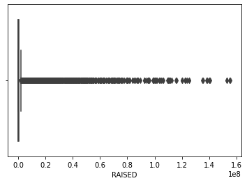
    


    

    


    
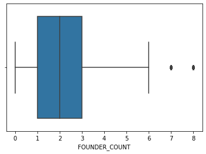
    


    
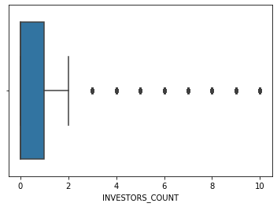
    


<div style="font-size: 18px">We can see that our outliers graph for numeric columns are much better now!<br>
Data cleaning is finished, le'ts fix our indexes and save the final data frame.</div>


```python
main_df.reset_index(inplace=True)
main_df
```


<div>
<style scoped>
    .dataframe tbody tr th:only-of-type {
        vertical-align: middle;
    }

    .dataframe tbody tr th {
        vertical-align: top;
    }

    .dataframe thead th {
        text-align: right;
    }
</style>
<table border="1" class="dataframe">
  <thead>
    <tr style="text-align: right;">
      <th></th>
      <th>index</th>
      <th>COMPANIE_NAME</th>
      <th>FOUNDED_MONTH</th>
      <th>FOUNDED_YEAR</th>
      <th>AGE</th>
      <th>B2B</th>
      <th>B2C</th>
      <th>B2G</th>
      <th>B2B2C</th>
      <th>EMPLOYEES</th>
      <th>...</th>
      <th>NEWS_COUNT</th>
      <th>FOUNDER_COUNT</th>
      <th>TOTAL_ROUNDS</th>
      <th>INVESTORS_COUNT</th>
      <th>IS_PUBLIC</th>
      <th>IS_ACQUIRED</th>
      <th>IS_ACTIVE</th>
      <th>IS_NOT_ACTIVE</th>
      <th>SECTOR</th>
      <th>TARGET_INDUSTORY</th>
    </tr>
  </thead>
  <tbody>
    <tr>
      <th>0</th>
      <td>0</td>
      <td>Golan Plastic Products</td>
      <td>1</td>
      <td>1964</td>
      <td>21320</td>
      <td>1</td>
      <td>0</td>
      <td>1</td>
      <td>0</td>
      <td>1</td>
      <td>...</td>
      <td>1</td>
      <td>4</td>
      <td>0</td>
      <td>0</td>
      <td>1</td>
      <td>0</td>
      <td>0</td>
      <td>0</td>
      <td>Industrial Technologies</td>
      <td>Energy, Utilities &amp; Waste Management</td>
    </tr>
    <tr>
      <th>1</th>
      <td>1</td>
      <td>Cham Foods</td>
      <td>12</td>
      <td>1970</td>
      <td>18800</td>
      <td>1</td>
      <td>0</td>
      <td>0</td>
      <td>1</td>
      <td>1</td>
      <td>...</td>
      <td>2</td>
      <td>2</td>
      <td>0</td>
      <td>0</td>
      <td>1</td>
      <td>0</td>
      <td>0</td>
      <td>0</td>
      <td>AgriFood-tech &amp; Water</td>
      <td>Agriculture &amp; Food</td>
    </tr>
    <tr>
      <th>2</th>
      <td>2</td>
      <td>HerbaMed</td>
      <td>1</td>
      <td>1986</td>
      <td>13290</td>
      <td>1</td>
      <td>1</td>
      <td>0</td>
      <td>0</td>
      <td>0</td>
      <td>...</td>
      <td>2</td>
      <td>2</td>
      <td>0</td>
      <td>0</td>
      <td>0</td>
      <td>0</td>
      <td>0</td>
      <td>1</td>
      <td>AgriFood-tech &amp; Water</td>
      <td>Agriculture &amp; Food</td>
    </tr>
    <tr>
      <th>3</th>
      <td>3</td>
      <td>RAD</td>
      <td>1</td>
      <td>1981</td>
      <td>15115</td>
      <td>1</td>
      <td>0</td>
      <td>1</td>
      <td>0</td>
      <td>4</td>
      <td>...</td>
      <td>13</td>
      <td>3</td>
      <td>0</td>
      <td>0</td>
      <td>0</td>
      <td>0</td>
      <td>1</td>
      <td>0</td>
      <td>Industrial Technologies</td>
      <td>Communication Services</td>
    </tr>
    <tr>
      <th>4</th>
      <td>5</td>
      <td>Ham-Let</td>
      <td>5</td>
      <td>1950</td>
      <td>26310</td>
      <td>1</td>
      <td>0</td>
      <td>0</td>
      <td>0</td>
      <td>3</td>
      <td>...</td>
      <td>7</td>
      <td>4</td>
      <td>0</td>
      <td>0</td>
      <td>0</td>
      <td>1</td>
      <td>0</td>
      <td>0</td>
      <td>Industrial Technologies</td>
      <td>Energy, Utilities &amp; Waste Management</td>
    </tr>
    <tr>
      <th>...</th>
      <td>...</td>
      <td>...</td>
      <td>...</td>
      <td>...</td>
      <td>...</td>
      <td>...</td>
      <td>...</td>
      <td>...</td>
      <td>...</td>
      <td>...</td>
      <td>...</td>
      <td>...</td>
      <td>...</td>
      <td>...</td>
      <td>...</td>
      <td>...</td>
      <td>...</td>
      <td>...</td>
      <td>...</td>
      <td>...</td>
      <td>...</td>
    </tr>
    <tr>
      <th>8816</th>
      <td>10373</td>
      <td>Expecting</td>
      <td>1</td>
      <td>2021</td>
      <td>515</td>
      <td>1</td>
      <td>1</td>
      <td>0</td>
      <td>0</td>
      <td>1</td>
      <td>...</td>
      <td>2</td>
      <td>2</td>
      <td>1</td>
      <td>0</td>
      <td>0</td>
      <td>0</td>
      <td>1</td>
      <td>0</td>
      <td>Life Sciences &amp; HealthTech</td>
      <td>Consumers</td>
    </tr>
    <tr>
      <th>8817</th>
      <td>10374</td>
      <td>Loona</td>
      <td>8</td>
      <td>2020</td>
      <td>670</td>
      <td>1</td>
      <td>0</td>
      <td>0</td>
      <td>0</td>
      <td>0</td>
      <td>...</td>
      <td>0</td>
      <td>2</td>
      <td>0</td>
      <td>0</td>
      <td>0</td>
      <td>0</td>
      <td>1</td>
      <td>0</td>
      <td>Enterprise, IT &amp; Data Infrastructure</td>
      <td>Industrial Manufacturing</td>
    </tr>
    <tr>
      <th>8818</th>
      <td>10375</td>
      <td>Quiz Beez</td>
      <td>6</td>
      <td>2021</td>
      <td>365</td>
      <td>0</td>
      <td>1</td>
      <td>0</td>
      <td>0</td>
      <td>0</td>
      <td>...</td>
      <td>0</td>
      <td>1</td>
      <td>0</td>
      <td>0</td>
      <td>0</td>
      <td>0</td>
      <td>1</td>
      <td>0</td>
      <td>Content &amp; Media</td>
      <td>Education</td>
    </tr>
    <tr>
      <th>8819</th>
      <td>10376</td>
      <td>Eureka Security</td>
      <td>10</td>
      <td>2021</td>
      <td>245</td>
      <td>1</td>
      <td>0</td>
      <td>0</td>
      <td>0</td>
      <td>1</td>
      <td>...</td>
      <td>2</td>
      <td>2</td>
      <td>1</td>
      <td>7</td>
      <td>0</td>
      <td>0</td>
      <td>1</td>
      <td>0</td>
      <td>Security Technologies</td>
      <td>Enterprise &amp; Professional Services</td>
    </tr>
    <tr>
      <th>8820</th>
      <td>10377</td>
      <td>Kitchezz</td>
      <td>11</td>
      <td>2020</td>
      <td>580</td>
      <td>1</td>
      <td>1</td>
      <td>0</td>
      <td>0</td>
      <td>0</td>
      <td>...</td>
      <td>0</td>
      <td>2</td>
      <td>0</td>
      <td>0</td>
      <td>0</td>
      <td>0</td>
      <td>1</td>
      <td>0</td>
      <td>Retail &amp; Marketing</td>
      <td>Commerce &amp; Retail</td>
    </tr>
  </tbody>
</table>
<p>8821 rows × 23 columns</p>
</div>


```python
main_df.to_csv('Data/companies_df/clean_df.csv', index=False)
```

# 4. EDA 📊📈📉


```python
df = pd.read_csv('Data/companies_df/clean_df.csv')
```


```python
df_raised_money = df[df['RAISED'] > 0]
df_didnt_raised_money = df[df['RAISED'] == 0]
print("Total number of companies after cleaning the data: ", len(df))
print("Number of companies who raised money: ",len(df_raised_money))
print("Number of companies who raised money: ",len(df_didnt_raised_money))
```

    Total number of companies after cleaning the data:  8821
    Number of companies who raised money:  2905
    Number of companies who raised money:  5916
    

## Let's look at the Status distribution of companies with RAISED money value


```python
fig, axs = plt.subplots(1,3)
fig.subplots_adjust(0.3,0,3,2)

labels = ['IS_PUBLIC', 'IS_ACTIVE', 'IS_ACQUIRED', 'IS_NOT_ACTIVE']

sizes = [len(df[df['IS_PUBLIC'] == 1]), len(df[df['IS_ACTIVE'] == 1]),len(df[df['IS_ACQUIRED'] == 1]), len(df[df['IS_NOT_ACTIVE'] == 1])]
axs[0].pie(sizes, labels=labels,autopct='%1.1f%%',  shadow=True)
axs[0].set_title("All companies", bbox={'facecolor':'0.8', 'pad':5})

sizes_raised = [len(df_raised_money[df_raised_money['IS_PUBLIC'] == 1]), len(df_raised_money[df_raised_money['IS_ACTIVE'] == 1]),len(df_raised_money[df_raised_money['IS_ACQUIRED'] == 1]), len(df_raised_money[df_raised_money['IS_NOT_ACTIVE'] == 1])]
axs[1].pie(sizes_raised, labels=labels,autopct='%1.1f%%',  shadow=True)
axs[1].set_title("Companies with Raised value", bbox={'facecolor':'0.8', 'pad':5})

sizes_didnt_raised = [len(df_didnt_raised_money[df_didnt_raised_money['IS_PUBLIC'] == 1]), len(df_didnt_raised_money[df_didnt_raised_money['IS_ACTIVE'] == 1]),len(df_didnt_raised_money[df_didnt_raised_money['IS_ACQUIRED'] == 1]), len(df_didnt_raised_money[df_didnt_raised_money['IS_NOT_ACTIVE'] == 1])]
axs[2].pie(sizes_didnt_raised, labels=labels,autopct='%1.1f%%',  shadow=True)
axs[2].set_title("Companies without Raised value", bbox={'facecolor':'0.8', 'pad':5})

plt.show()
```


    

    


### As we can see, companies who raised money are more likely to be aquired or public.


# Let's define what a successful company is:
   ## - If the company is acquired or public we will consider it a successful company.


```python
df_succeeded_companies = df[(df.IS_ACQUIRED == 1) | (df.IS_PUBLIC == 1)]
df_unsucceeded_companies = df[(df.IS_ACQUIRED == 0) & (df.IS_PUBLIC == 0)]
print("The number of succeeded companies is: ",len(df_succeeded_companies))
print("The number of unSucceeded companies is: ",len(df_unsucceeded_companies))
```

    The number of succeeded companies is:  1073
    The number of unSucceeded companies is:  7748
    

## After we defined what a successful company is, we need to convert our 4 status columns to 'is_successful' column.


```python
def extract_company_status(main_df):
    is_successful = list()

    for index, row in df.iterrows():
        if(row['IS_PUBLIC'] | row['IS_ACQUIRED']):
            is_successful.append(1)
        else:
            is_successful.append(0)
    
    return is_successful
```


```python
is_successful = extract_company_status(df)
df.insert(loc=16, column='IS_SUCCESSFUL', value=is_successful)
df.drop(columns = ['IS_PUBLIC'], axis=1, inplace=True)
df.drop(columns = ['IS_ACQUIRED'], axis=1, inplace=True)
df.drop(columns = ['IS_ACTIVE'], axis=1, inplace=True)
df.drop(columns = ['IS_NOT_ACTIVE'], axis=1, inplace=True)
df.drop(columns = ['COMPANIE_NAME'], axis=1, inplace=True)
```

### We will now examine whether the number of employees affects the company's success.


```python
ct = pd.crosstab(df['EMPLOYEES'], (df['IS_SUCCESSFUL']), normalize="index")

ax = ct.plot(kind="bar", figsize=(18,6), label=["1-10","11-50","51-200","201-500","500+"])
ax.legend(["Unsuccessful", "Successful"],fancybox=True, framealpha=1, shadow=True, borderpad=1)
for container in ax.containers:
    ax.bar_label(container)

plt.title("Number of employees in successful companies", fontsize = 20)
plt.ylabel("Relative frequency")
```


    Text(0, 0.5, 'Relative frequency')


    
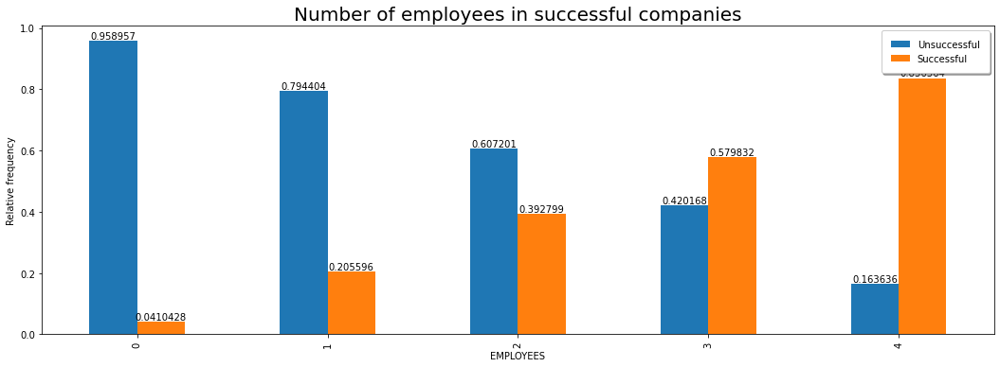
    


### It can certainly be seen that the larger the number of employees, the greater the chances of success.

### We tried to check if there is a relationship between the age of a company and the number of company investors


```python
x = df_raised_money.AGE
y = df_raised_money.RAISED
A = np.vstack([x, np.ones(len(x))]).T

y = y[:, np.newaxis]
alpha = np.dot((np.dot(np.linalg.inv(np.dot(A.T,A)),A.T)),y)

plt.figure(figsize = (8,6))
plt.plot(x, y, 'b.')
plt.plot(x, alpha[0]*x + alpha[1], 'r')
plt.xlabel('Age in days')
plt.ylabel('Amount of money raised in Billion $')
plt.show()
```


    

    


From the graph it can be seen that there is a real connection between the age of the company in days and the amount of money that the company raised.
It can be understood from this graph that the longer a company exists, the more likely it is to raise money.
And as we have seen before, companies that raise money are more likely to succeed.

### We are now trying to test relationships and behaviors between quantitative variables. *
* We chose to take the columns:<br>
    ~EMPLOYEES<br>
    ~NEWS_COUNT<br>
    ~FOUNDER_COUNT<br>
    ~INVESTORS_COUNT<br>


```python
corr = df[['EMPLOYEES', 'NEWS_COUNT', 'FOUNDER_COUNT','INVESTORS_COUNT']].corr()
mask = np.zeros_like(corr)
with sns.axes_style("darkgrid"):
    f, ax = plt.subplots(figsize=(15, 15))
    ax = sns.heatmap(corr, mask=mask, vmax=1, square=True,annot=True)
    
# df = pd.DataFrame(df)
# sns.heatmap(df.corr(), annot=True)

```


    

    


### We were able to find out that there is a strong connection between the number of employees in the company and the number of news articles about the company.


```python
ct2 = pd.crosstab(df[(df['RAISED'] == 0)]['TARGET_INDUSTORY'], df[(df['RAISED'] == 0)]['SECTOR'])
ct2
```


<div>
<style scoped>
    .dataframe tbody tr th:only-of-type {
        vertical-align: middle;
    }

    .dataframe tbody tr th {
        vertical-align: top;
    }

    .dataframe thead th {
        text-align: right;
    }
</style>
<table border="1" class="dataframe">
  <thead>
    <tr style="text-align: right;">
      <th>SECTOR</th>
      <th>Aerospace &amp; Aviation</th>
      <th>AgriFood-tech &amp; Water</th>
      <th>Content &amp; Media</th>
      <th>Energy-tech</th>
      <th>Enterprise, IT &amp; Data Infrastructure</th>
      <th>FinTech</th>
      <th>Industrial Technologies</th>
      <th>Life Sciences &amp; HealthTech</th>
      <th>Retail &amp; Marketing</th>
      <th>Security Technologies</th>
      <th>Smart Mobility</th>
    </tr>
    <tr>
      <th>TARGET_INDUSTORY</th>
      <th></th>
      <th></th>
      <th></th>
      <th></th>
      <th></th>
      <th></th>
      <th></th>
      <th></th>
      <th></th>
      <th></th>
      <th></th>
    </tr>
  </thead>
  <tbody>
    <tr>
      <th>Agriculture &amp; Food</th>
      <td>11</td>
      <td>343</td>
      <td>1</td>
      <td>10</td>
      <td>11</td>
      <td>3</td>
      <td>34</td>
      <td>8</td>
      <td>1</td>
      <td>4</td>
      <td>4</td>
    </tr>
    <tr>
      <th>Commerce &amp; Retail</th>
      <td>1</td>
      <td>8</td>
      <td>53</td>
      <td>10</td>
      <td>86</td>
      <td>20</td>
      <td>44</td>
      <td>61</td>
      <td>189</td>
      <td>19</td>
      <td>10</td>
    </tr>
    <tr>
      <th>Communication Services</th>
      <td>3</td>
      <td>0</td>
      <td>15</td>
      <td>3</td>
      <td>24</td>
      <td>2</td>
      <td>61</td>
      <td>2</td>
      <td>5</td>
      <td>13</td>
      <td>5</td>
    </tr>
    <tr>
      <th>Consumers</th>
      <td>4</td>
      <td>32</td>
      <td>711</td>
      <td>23</td>
      <td>169</td>
      <td>163</td>
      <td>21</td>
      <td>293</td>
      <td>222</td>
      <td>85</td>
      <td>87</td>
    </tr>
    <tr>
      <th>Defense, Safety &amp; Security</th>
      <td>34</td>
      <td>0</td>
      <td>3</td>
      <td>8</td>
      <td>16</td>
      <td>1</td>
      <td>55</td>
      <td>11</td>
      <td>0</td>
      <td>112</td>
      <td>8</td>
    </tr>
    <tr>
      <th>Education</th>
      <td>0</td>
      <td>1</td>
      <td>33</td>
      <td>0</td>
      <td>7</td>
      <td>1</td>
      <td>3</td>
      <td>13</td>
      <td>0</td>
      <td>7</td>
      <td>0</td>
    </tr>
    <tr>
      <th>Energy, Utilities &amp; Waste Management</th>
      <td>2</td>
      <td>40</td>
      <td>1</td>
      <td>65</td>
      <td>5</td>
      <td>0</td>
      <td>40</td>
      <td>2</td>
      <td>0</td>
      <td>17</td>
      <td>1</td>
    </tr>
    <tr>
      <th>Enterprise &amp; Professional Services</th>
      <td>0</td>
      <td>2</td>
      <td>108</td>
      <td>8</td>
      <td>552</td>
      <td>41</td>
      <td>17</td>
      <td>10</td>
      <td>235</td>
      <td>169</td>
      <td>5</td>
    </tr>
    <tr>
      <th>Financial Services</th>
      <td>0</td>
      <td>0</td>
      <td>1</td>
      <td>0</td>
      <td>29</td>
      <td>80</td>
      <td>1</td>
      <td>4</td>
      <td>5</td>
      <td>14</td>
      <td>3</td>
    </tr>
    <tr>
      <th>Food Retail &amp; Consumption</th>
      <td>0</td>
      <td>17</td>
      <td>5</td>
      <td>1</td>
      <td>7</td>
      <td>0</td>
      <td>3</td>
      <td>2</td>
      <td>15</td>
      <td>0</td>
      <td>0</td>
    </tr>
    <tr>
      <th>Government &amp; City</th>
      <td>0</td>
      <td>7</td>
      <td>2</td>
      <td>5</td>
      <td>3</td>
      <td>1</td>
      <td>5</td>
      <td>2</td>
      <td>1</td>
      <td>8</td>
      <td>10</td>
    </tr>
    <tr>
      <th>Healthcare &amp; Life Sciences</th>
      <td>0</td>
      <td>12</td>
      <td>4</td>
      <td>4</td>
      <td>12</td>
      <td>2</td>
      <td>40</td>
      <td>608</td>
      <td>0</td>
      <td>1</td>
      <td>0</td>
    </tr>
    <tr>
      <th>Industrial Manufacturing</th>
      <td>9</td>
      <td>8</td>
      <td>0</td>
      <td>14</td>
      <td>12</td>
      <td>0</td>
      <td>100</td>
      <td>1</td>
      <td>2</td>
      <td>13</td>
      <td>23</td>
    </tr>
    <tr>
      <th>Media &amp; Entertainment</th>
      <td>0</td>
      <td>0</td>
      <td>126</td>
      <td>0</td>
      <td>4</td>
      <td>1</td>
      <td>1</td>
      <td>0</td>
      <td>24</td>
      <td>0</td>
      <td>1</td>
    </tr>
    <tr>
      <th>Real Estate &amp; Construction</th>
      <td>0</td>
      <td>4</td>
      <td>1</td>
      <td>11</td>
      <td>9</td>
      <td>9</td>
      <td>31</td>
      <td>0</td>
      <td>6</td>
      <td>4</td>
      <td>0</td>
    </tr>
    <tr>
      <th>Transportation &amp; Logistics</th>
      <td>2</td>
      <td>0</td>
      <td>1</td>
      <td>0</td>
      <td>5</td>
      <td>1</td>
      <td>6</td>
      <td>0</td>
      <td>5</td>
      <td>3</td>
      <td>15</td>
    </tr>
    <tr>
      <th>Travel &amp; Tourism</th>
      <td>0</td>
      <td>0</td>
      <td>6</td>
      <td>0</td>
      <td>12</td>
      <td>1</td>
      <td>1</td>
      <td>1</td>
      <td>19</td>
      <td>3</td>
      <td>0</td>
    </tr>
  </tbody>
</table>
</div>


In this graph we see the distribution of companies by target industory


```python
fig, ax = plt.subplots(figsize=(18, 4))
fg = sns.histplot(df['TARGET_INDUSTORY'], ax=ax)
fg.set_title("Target Industory Histogram")
fg.set_xlabel("Target Industory")
plt.xticks(rotation=90, ha='right', rotation_mode='anchor')
plt.show()
```


    
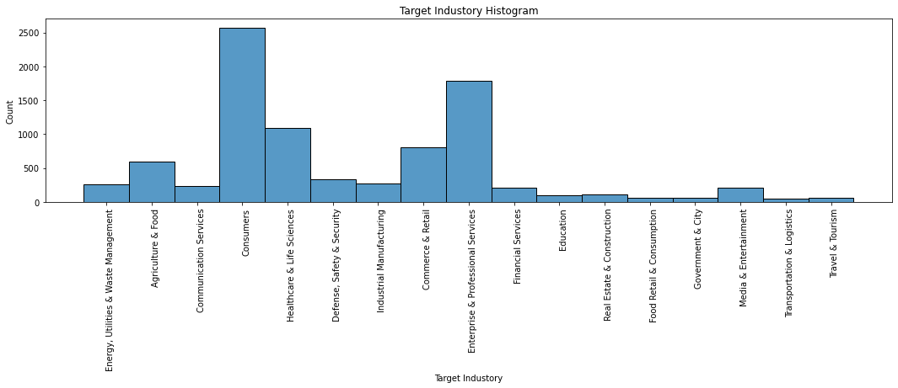
    


### We can seen that the most common sectors are:
       1. Consumers
       2. Enterprise & Professional Services
       3. Life Sciences & HealthTech
       

### We will try to examine information with a large number of columns, to check if the number of companies is divided into several subgroups we will do this using PCA

### EDA - Principle Component Analysis (PCA)  


### Step 1
We create a dataframe containing some numerical variables of our data set:


```python
dataset = df.loc[:,[ 'NEWS_COUNT', 'FOUNDER_COUNT', 'TOTAL_ROUNDS', 'INVESTORS_COUNT','EMPLOYEES','PRODUCT_STAGE']]
dataset.shape
```


    (8821, 6)


## Step 2
We now need to create a PCA object, and then call the function that performs PCA on the dataset.
the parameter *n_componenets*, which determines the number of dimesions we would like to have in the end:


```python
pca2 = PCA(n_components=2) #creating a PCA object, while determining the desired number of dimensions
pcComponents = pca2.fit_transform(dataset) #performing PCA using fit_transform on our dataset
```

PCA creates new axes, hence, new variables - pcComponents is the new numerical data, with two dimensions:


```python
pcComponents.shape
```


    (8821, 2)


### Step 3
To make it easy to display our results, we will create a new dataframe with the new features: 


```python
principalDf = pd.DataFrame(data = pcComponents, columns = ['principal component 1', 'principal component 2'])
principalDf
```


<div>
<style scoped>
    .dataframe tbody tr th:only-of-type {
        vertical-align: middle;
    }

    .dataframe tbody tr th {
        vertical-align: top;
    }

    .dataframe thead th {
        text-align: right;
    }
</style>
<table border="1" class="dataframe">
  <thead>
    <tr style="text-align: right;">
      <th></th>
      <th>principal component 1</th>
      <th>principal component 2</th>
    </tr>
  </thead>
  <tbody>
    <tr>
      <th>0</th>
      <td>-1.057272</td>
      <td>-0.672293</td>
    </tr>
    <tr>
      <th>1</th>
      <td>-0.516033</td>
      <td>-1.171117</td>
    </tr>
    <tr>
      <th>2</th>
      <td>-0.620490</td>
      <td>-1.167730</td>
    </tr>
    <tr>
      <th>3</th>
      <td>9.815548</td>
      <td>-5.517506</td>
    </tr>
    <tr>
      <th>4</th>
      <td>4.519727</td>
      <td>-3.071575</td>
    </tr>
    <tr>
      <th>...</th>
      <td>...</td>
      <td>...</td>
    </tr>
    <tr>
      <th>8816</th>
      <td>-0.311000</td>
      <td>-0.760671</td>
    </tr>
    <tr>
      <th>8817</th>
      <td>-2.873409</td>
      <td>-0.201562</td>
    </tr>
    <tr>
      <th>8818</th>
      <td>-3.050129</td>
      <td>-0.251598</td>
    </tr>
    <tr>
      <th>8819</th>
      <td>1.976308</td>
      <td>4.964279</td>
    </tr>
    <tr>
      <th>8820</th>
      <td>-2.409851</td>
      <td>-0.370227</td>
    </tr>
  </tbody>
</table>
<p>8821 rows × 2 columns</p>
</div>


### Step 4
We also add the IS_SUCCESSFUL feature, so we will be able to display the data separating successful and unseccessful comapnies:


```python
finalDf = pd.concat([principalDf, df[['IS_SUCCESSFUL']]], axis = 1)
```

### Step 5
We are ready to see our results. We will use a scatterplot:


```python
fig = plt.figure()
ax = plt.axes()
colormap = np.array(['r', 'b'])
ax.scatter(finalDf['principal component 1'], finalDf['principal component 2'], c=colormap[finalDf.IS_SUCCESSFUL])
plt.xlabel('PC1')
plt.ylabel('PC2')
plt.show()
```


    

    


As you can see, we ***can't*** see in this figure a clear separation of successful and unsuccessful companies.

## Chi-Square Test of Independence.

#### We will try to check if there is a relationship between categorical variables.
    *EMPLOYEES column
    *PRODUCT_STAGE column


```python
ct1 = pd.crosstab(df.PRODUCT_STAGE, df.EMPLOYEES)
ct1
```


<div>
<style scoped>
    .dataframe tbody tr th:only-of-type {
        vertical-align: middle;
    }

    .dataframe tbody tr th {
        vertical-align: top;
    }

    .dataframe thead th {
        text-align: right;
    }
</style>
<table border="1" class="dataframe">
  <thead>
    <tr style="text-align: right;">
      <th>EMPLOYEES</th>
      <th>0</th>
      <th>1</th>
      <th>2</th>
      <th>3</th>
      <th>4</th>
    </tr>
    <tr>
      <th>PRODUCT_STAGE</th>
      <th></th>
      <th></th>
      <th></th>
      <th></th>
      <th></th>
    </tr>
  </thead>
  <tbody>
    <tr>
      <th>0</th>
      <td>196</td>
      <td>8</td>
      <td>1</td>
      <td>0</td>
      <td>0</td>
    </tr>
    <tr>
      <th>1</th>
      <td>1084</td>
      <td>119</td>
      <td>2</td>
      <td>0</td>
      <td>0</td>
    </tr>
    <tr>
      <th>2</th>
      <td>177</td>
      <td>65</td>
      <td>3</td>
      <td>0</td>
      <td>0</td>
    </tr>
    <tr>
      <th>3</th>
      <td>286</td>
      <td>22</td>
      <td>1</td>
      <td>1</td>
      <td>0</td>
    </tr>
    <tr>
      <th>4</th>
      <td>700</td>
      <td>108</td>
      <td>3</td>
      <td>0</td>
      <td>0</td>
    </tr>
    <tr>
      <th>5</th>
      <td>3234</td>
      <td>2037</td>
      <td>601</td>
      <td>118</td>
      <td>55</td>
    </tr>
  </tbody>
</table>
</div>


```python
chi2_contingency(ct1)
```


    (1071.8373864739401,
     1.8320493744078054e-214,
     20,
     array([[1.31933454e+02, 5.48231493e+01, 1.41996372e+01, 2.76555946e+00,
             1.27819975e+00],
            [7.75511280e+02, 3.22253146e+02, 8.34661603e+01, 1.62560934e+01,
             7.51332049e+00],
            [1.57676567e+02, 6.55203492e+01, 1.69702982e+01, 3.30518082e+00,
             1.52760458e+00],
            [1.99509126e+02, 8.29032989e+01, 2.14726222e+01, 4.18206553e+00,
             1.93288743e+00],
            [5.21941617e+02, 2.16885727e+02, 5.61751502e+01, 1.09408230e+01,
             5.05668292e+00],
            [3.89042796e+03, 1.61661433e+03, 4.18716132e+02, 8.15502777e+01,
             3.76913048e+01]]))


* We got
    * 1071.8373864739401 Chi-Square<br>
    * p_vaule < 0.05<br>
* We therefore see that there is a relationship between the variables and they are not independent <br>
    * PRODUCT_STAGE column<br>
    * EMPLOYEES column<br>
* From chi square test we have learned that PRODUCT_STAGE and EMPLOYEES features that the higher number of employees is the higher the product stage is and the opposite claim is also true.


```python
df.to_csv('Data/companies_df/eda_df.csv', index=False)
```

# 5. Machine Learning 🤖🤖🤖


```python
df = pd.read_csv('Data/companies_df/eda_df.csv')
```

## To start with the machine learning train and prediction, we need to convert our 4 status columns to 'is_successful' column.

<div style="font-size: 18px">'SECTOR' and 'TARGET_INDUSTORY' are not ordinal categorical so we can give them codes in any order.</div>


```python
sector_replace_map = dict( enumerate(df['SECTOR'].astype('category').cat.categories ))
sector_replace_map = dict([(value, key) for key, value in sector_replace_map.items()])
df['SECTOR'].replace(sector_replace_map, inplace=True)

target_replace_map = dict( enumerate(df['TARGET_INDUSTORY'].astype('category').cat.categories ))
target_replace_map = dict([(value, key) for key, value in target_replace_map.items()])
df['TARGET_INDUSTORY'].replace(target_replace_map, inplace=True)
```

We need to predict the ‘IS_SUCCESSFUL’ column. Let us separate it and assign it to a target variable ‘y’. The rest of the data frame will be the set of input variables X.


```python
y = df["IS_SUCCESSFUL"].values
x = df.drop(["IS_SUCCESSFUL"],axis=1)
```

Now let’s scale the predictor variables and then separate the training and the testing data.


```python
#Divide into training and test data
X_train, X_test, y_train, y_test = train_test_split(x, y, random_state=0 ,test_size = 0.3) # 70% training and 30% test
```

# Logistic Regression


```python
clf = LogisticRegression(solver='lbfgs', max_iter=1000)
clf.fit(X_train, y_train)
y_predict = clf.predict(X_test)
acc = clf.score(X_test,y_test)
print(f"Accuracy of our model using logistic regression: {acc}")
```

    Accuracy of our model using logistic regression: 0.8734416320362675
    

Lets display our predicted result with confusion matrix


```python
y_predict = clf.predict(X_test)
cf_matrix = metrics.confusion_matrix(y_test, y_predict)

ax= plt.subplot()
sns.heatmap(cf_matrix, annot=True, fmt='g', ax=ax, cmap='Blues');  #annot=True to annotate cells, ftm='g' to disable scientific notation

# labels, title and ticks
ax.set_xlabel('Predicted labels');ax.set_ylabel('True labels'); ax.set_title('Confusion Matrix'); ax.xaxis.set_ticklabels(['False','True']);ax.yaxis.set_ticklabels(['False','True']);
```


    

    


```python
print("accuracy is:",metrics.accuracy_score(y_test, y_predict))
print("precision is:",metrics.precision_score(y_test, y_predict))
print("recall is:",metrics.recall_score(y_test, y_predict))
print("f1 is:",metrics.f1_score(y_test, y_predict))
```

    accuracy is: 0.8734416320362675
    precision is: 0.5
    recall is: 0.03582089552238806
    f1 is: 0.06685236768802229
    

As we can see the results are not so great, lets try make some changes:

First, We found that 'TARGET_INDUSTORY' and 'FOUNDED_YEAR' features degrades model performance so we will drop them.

Second, We want to scale our 'RAISED' feature because it has very high values.


```python
df.drop(columns = ['TARGET_INDUSTORY'], axis=1, inplace=True)
df.drop(columns = ['FOUNDED_YEAR'], axis=1, inplace=True)

df[['RAISED']] = minmax_scale(df[['RAISED']])


y = df["IS_SUCCESSFUL"].values
x = df.drop(["IS_SUCCESSFUL"],axis=1)

X_train, X_test, y_train, y_test = train_test_split(x, y, random_state=0 ,test_size = 0.3) # 70% training and 30% test

clf = LogisticRegression(solver='lbfgs', max_iter=1000)
clf.fit(X_train, y_train)
y_predict = clf.predict(X_test)

```


```python
ax= plt.subplot()
cf_matrix = metrics.confusion_matrix(y_test, y_predict)
sns.heatmap(cf_matrix, annot=True, fmt='g', ax=ax, cmap='Blues');  #annot=True to annotate cells, ftm='g' to disable scientific notation
# labels, title and ticks
ax.set_xlabel('Predicted labels');ax.set_ylabel('True labels'); ax.set_title('Confusion Matrix'); ax.xaxis.set_ticklabels(['False','True']);ax.yaxis.set_ticklabels(['False','True']);
```


    
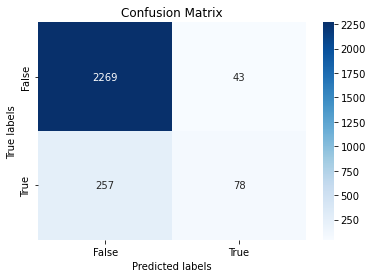
    


Now lets look at the results again.


```python
print("accuracy is:",metrics.accuracy_score(y_test, y_predict))
print("precision is:",metrics.precision_score(y_test, y_predict))
print("recall is:",metrics.recall_score(y_test, y_predict))
print("f1 is:",metrics.f1_score(y_test, y_predict))
```

    accuracy is: 0.8866641480921799
    precision is: 0.6446280991735537
    recall is: 0.23283582089552238
    f1 is: 0.3421052631578947
    

### As we can see we got about 20-40% higher results!!!

# KNN - K-Nearest Neighbors


```python
# set up the model, k-NN classification with k = ?  
k = 3
clf = KNeighborsClassifier(n_neighbors=k)
clf.fit(X_train, y_train)
y_predict = clf.predict(X_test)

cf_matrix = metrics.confusion_matrix(y_true = y_test, y_pred = y_predict)

print('Accuracy = ', metrics.accuracy_score(y_true = y_test, y_pred = y_predict))

```

    Accuracy =  0.8587079712882508
    

### Let us take a few possible values of k and fit the model on the training data for all those values. We will also compute the training score and testing score for all those values.


```python
train_score = []
test_score = []
k_vals = []

for k in range(1, 75):
    k_vals.append(k)
    knn = KNeighborsClassifier(n_neighbors = k)
    knn.fit(X_train, y_train)
    
    tr_score = knn.score(X_train, y_train)
    train_score.append(tr_score)
    
    te_score = knn.score(X_test, y_test)
    test_score.append(te_score)

print(f"Max train_score is: {max(train_score)}\nMax test_score is: {max(test_score)}")
```

    Max train_score is: 1.0
    Max test_score is: 0.8745749905553457
    


```python
plt.figure(figsize=(10,5))
plt.xlabel('Different Values of K')
plt.ylabel('Model score')
plt.plot(k_vals, train_score, color = 'r', label = "training score")
plt.plot(k_vals, test_score, color = 'b', label = 'test score')
plt.legend(bbox_to_anchor=(1, 1),
           bbox_transform=plt.gcf().transFigure)
plt.show()

```


    

    


### We found the best K for our model!<br>K = 10<br>Accuracy =  0.8745749905553457


```python
knn = KNeighborsClassifier(n_neighbors = 10)

#Fit the model
knn.fit(X_train,y_train)

#get the score
knn.score(X_test,y_test)

```


    0.8745749905553457


We can make the following conclusions from the above plot:

* For low values of k, the training score is high, while the testing score is low.
* As the value of k increases, the testing score starts to increase and the training score starts to decrease.
* However, the higher the value of k, both the training score and the testing score are close to each other.


# Decision Trees


```python
def splitData(df, features, labels, specifed_random_state=0):
    """Split a subset of the dataset, given by the features, into train and test sets."""
    df_predictors = df[features].values
    df_labels = df[labels].values

    # Split into training and test sets
    XTrain, XTest, yTrain, yTest = train_test_split(df_predictors, df_labels, random_state=specifed_random_state)
    return XTrain, XTest, yTrain, yTest
```


```python
def renderTree(my_tree, features):
    # hacky solution of writing to files and reading again
    # necessary due to library bugs
    filename = "temp.dot"
    with open(filename, 'w') as f:
        f = tree.export_graphviz(my_tree, 
                                 out_file=f, 
                                 feature_names=features, 
                                 class_names=["Perished", "Survived"],  
                                 filled=True, 
                                 rounded=True,
                                 special_characters=True)
  
    dot_data = ""
    with open(filename, 'r') as f:
        dot_data = f.read()

    graph = pydotplus.graph_from_dot_data(dot_data)
    image_name = "temp.png"
    graph.write_png(image_name)  
    display(Image(filename=image_name))
```

And here you can see the decision tree model with the prediction and accuracy of the training and testing of the model based on 'NEWS_COUNT' feature only.


```python
decisionTree = tree.DecisionTreeClassifier()
features = ['NEWS_COUNT']

XTrain, XTest, yTrain, yTest = splitData(df, features, ["IS_SUCCESSFUL"])
# fit the tree with the traing data
decisionTree = decisionTree.fit(XTrain, yTrain)

# predict with the training data
y_pred_train = decisionTree.predict(XTrain)
# measure accuracy
print('Accuracy on training data = ', 
      metrics.accuracy_score(y_true = yTrain, y_pred = y_pred_train))

# predict with the test data
y_pred = decisionTree.predict(XTest)
# measure accuracy
print('Accuracy on test data = ', 
      metrics.accuracy_score(y_true = yTest, y_pred = y_pred))

renderTree(decisionTree, features)
```

    Accuracy on training data =  0.8808767951625095
    Accuracy on test data =  0.8739800543970988
    


    

    


```python
decisionTree = tree.DecisionTreeClassifier()
all_features = df.columns.tolist()

all_features.remove('IS_SUCCESSFUL')

# fit the tree with the traing data
decisionTree = decisionTree.fit(X_train,y_train)

# predict with the training data
y_predict_train = decisionTree.predict(X_train)
# measure accuracy
print('Accuracy on training data = ', 
      metrics.accuracy_score(y_true = y_train, y_pred = y_predict_train))

# predict with the test data
y_predict = decisionTree.predict(X_test)
# measure accuracy
print('Accuracy on test data = ', 
      metrics.accuracy_score(y_true = y_test, y_pred = y_predict))

renderTree(decisionTree,all_features)
```

    Accuracy on training data =  1.0
    Accuracy on test data =  0.8617302606724594
    dot: graph is too large for cairo-renderer bitmaps. Scaling by 0.899402 to fit
    
    


    

    


OK, clearly, we're overfitting the data - 100% accuracy on the training data and only ~86% on the test data. Yet, we've created a complicated tree.


```python
decisionTree = tree.DecisionTreeClassifier(max_depth=5, min_samples_split=20)
XTrain, XTest, yTrain, yTest = splitData(df, all_features, ["IS_SUCCESSFUL"])
decisionTree = decisionTree.fit(XTrain, yTrain)

y_pred_train = decisionTree.predict(XTrain)
print('Accuracy on training data= ', metrics.accuracy_score(y_true = yTrain, y_pred = y_pred_train))

y_pred = decisionTree.predict(XTest)
print('Accuracy on test data= ', metrics.accuracy_score(y_true = yTest, y_pred = y_pred))

renderTree(decisionTree, all_features)

```

    Accuracy on training data=  0.8946334089191232
    Accuracy on test data=  0.8907524932003626
    


    

    


### Slight improvement 89% for training and test without overfitting<br>
We got ourselves a better training accuracy but the test prediction did not improve by a noticiable percentage.

# Naive Bayes


```python
# Split into training and test sets
y = df["IS_SUCCESSFUL"].values
x = df.drop(["IS_SUCCESSFUL"],axis=1)

XTrain, XTest, yTrain, yTest = train_test_split(x, y, random_state=0, test_size=0.25)

```


```python
# Instantiate the classifier
gnb = GaussianNB()

gnb.fit(XTrain,yTrain)

y_pred = gnb.predict(XTest)
y_pred_train = gnb.predict(XTrain)

# Print results
print('Accuracy on Train data= ', metrics.accuracy_score(y_true = yTrain, y_pred = y_pred_train))
print('Accuracy on test data= ', metrics.accuracy_score(y_true = yTest, y_pred = y_pred))
```

    Accuracy on Train data=  0.816780045351474
    Accuracy on test data=  0.8250226654578422
    


```python
gnb.class_prior_

```


    array([0.87951625, 0.12048375])


We can see that only about 12% SUCCESSFUL.. 

## In conclusion, we have seen that the algorithms that have brought us the best results are Decision Trees and Logistic Regression with about 89% accuracy.

```python
df.to_csv('Data/companies_df/final_df.csv', index=False)
```

#### Credit: part of the code was taken from Data Science course Campus IL

```python

```
